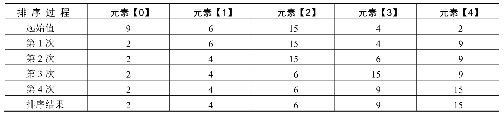
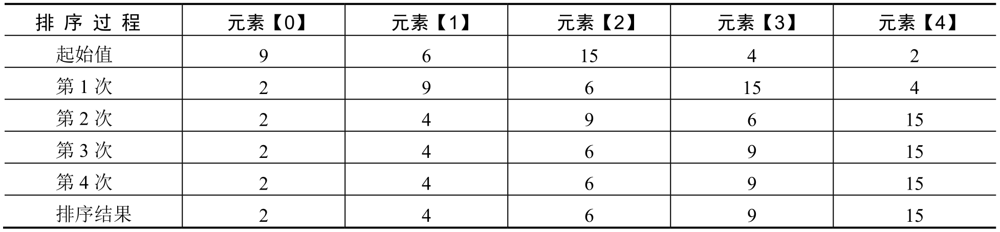
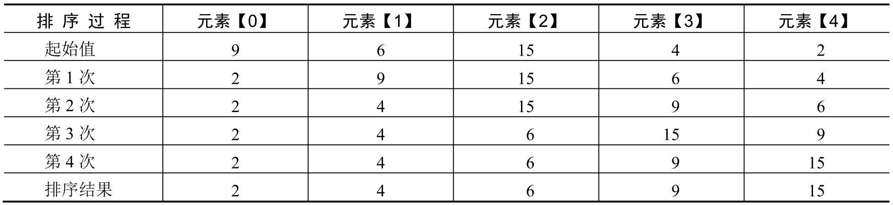
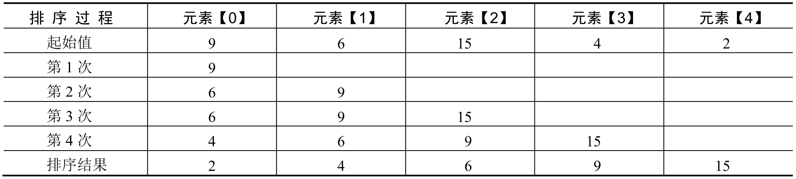
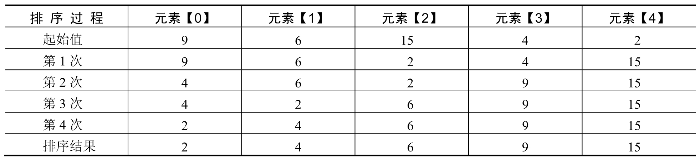

## 一维数组的定义

```c
#include <stdio.h>
int main() {
    int iArray[6];

    for (int i = 0; i < 6; ++i) {
        iArray[i] = i*2;
    }

    for (int i = 0; i < 6; ++i) {
        printf("%d ",iArray[i]);
    }
    return 0;
}
```

输出

```c
0 2 4 6 8 10
```

## 一维数组的初始化

```c
#include <stdio.h>
int main() {
    // 全部赋值
    int arr1[6] = {1,2,3,4,5,6};
    // 只给一部分赋值
    int arr2[6] = {1,2,3};
    // 不指定长度
    int arr3[] = {1,2,3,4};
    return 0;
}
```

## 字符数组的定义

```c
#include <stdio.h>
int main() {
    char arr1[5];
    arr1[0] = 'H';
    arr1[1] = 'e';
    arr1[2] = 'l';
    arr1[3] = 'l';
    arr1[4] = 'o';

    for (int i = 0; i < 5; ++i) {
        printf("%c",arr1[i]);
    }
    return 0;
}
```

## 字符数组初始化

```c
#include <stdio.h>
int main() {
    // 赋值方式一
    char arr1[5] = {'H','e','l','l','o'};
    // 不给出长度
    char arr2[] = {'H','e','l','l','o'};
    // 赋值方式二
    char arr3[5] = {"Hello"};
    // 赋值方式三
    char arr4[5] = "hello";


    for (int i = 0; i < 5; ++i) {
        printf("%c",arr4[i]);
    }
    return 0;
}
```

## 数组排序算法

### 选择排序

选择法排序的原理如下：每次在待排序数组中查找最大或最小的数组元素，将其值与最前面没有进行过排序的数组元素的值互换。这里，由大到小排序应查找最大值，由小到大排序则应查找最小值



```c
#include <stdio.h>
int main() {
    int arr[5] = {9,6,15,4,2};
    int iTemp; // 最小数组元素
    int iPos;  // 元素位置

    /** 使用选择排序对数组元素从小到大排序 */
    for(int i = 0; i < 4; i++){
        iTemp = arr[i];
        iPos = i;
        for(int j = i + 1; j < 5; j++){
            if(arr[j] < iTemp){
                iTemp = arr[j];
                iPos = j;
            }
        }
        arr[iPos] = arr[i];
        arr[i] = iTemp;
    }

    for (int i = 0; i < 5; ++i) {
        printf("%d ",arr[i]);
    }
    return 0;
}
```

### 冒泡排序

冒泡法排序的原理如下：每次比较数组中相邻的两个数组元素的值，将较小的数排在较大的数前面，可实现数组元素从小到大排序；每次将较大的数排在较小的数前面，可实现数组元素从大到小排序。



```c
#include <stdio.h>
int main() {
    int arr[5] = {9,6,15,4,2};
    int iTemp; // 临时变量

    /** 使用冒泡法对数组元素从小到大排序 */
    for(int i = 0; i < 5; i++){
        for(int j = 4; j >= i; j--){
            if(arr[j] < arr[j-1]){
               iTemp = arr[j-1];
               arr[j-1] = arr[j];
               arr[j] = iTemp;
            }
        }
    }

    for (int i = 0; i < 5; ++i) {
        printf("%d ",arr[i]);
    }
    return 0;
}
```

### 交换排序

交换法排序是将每一位数与其后的所有数一一比较，如果发现符合条件的数据，则交换数据。首先，用第一个数依次与其后的所有数进行比较，如果存在比其值大（小）的数，则交换这两个数，继续向后比较其他数直至最后一个数。然后再使用第二个数与其后面的数进行比较，如果存在比其值大（小）的数，则交换这两个数。继续向后比较其他数，直至最后一个数比较完成。



```c
#include <stdio.h>
int main() {
    int arr[5] = {9,6,15,4,2};
    int iTemp; // 临时变量

    /** 使用选择法对数组元素从小到大排序 */
    for(int i = 0; i < 4; i++){
        for(int j = i + 1; j < 5; j++){
            if(arr[j] < arr[i]){
               iTemp = arr[j];
               arr[j] = arr[i];
               arr[i] = iTemp;
            }
        }
    }

    for (int i = 0; i < 5; ++i) {
        printf("%d ",arr[i]);
    }
    return 0;
}
```

### 插入排序

插入法排序较为复杂，其基本原理是：抽出一个数据，在前面的数据中寻找相应的位置插入，然后继续下一个数据，直到完成排序。



```c
#include <stdio.h>
int main() {
    int arr[5] = {9,6,15,4,2};
    int iTemp; // 临时变量
    int iPos;

    /** 使用插入法对数组元素从小到大排序 */
    for(int i = 0; i < 5; i++){
        iTemp = arr[i]; // 插入的值
        iPos = i - 1;
        while ((iPos >= 0) && (iTemp < arr[iPos])){
            arr[iPos+1] = arr[iPos];
            iPos--;
        }
        arr[iPos+1] = iTemp;
    }

    for (int i = 0; i < 5; ++i) {
        printf("%d ",arr[i]);
    }
    return 0;
}
```

### 快速排序(折半排序)

折半法排序又称为快速排序，其基本原理为：选择一个中间值（在程序中使用数组中间元素的值），然后把比中间值小的元素放在左边，比中间值大的元素放在右边（具体的实现是从两边查找，找到一对后进行交换），然后再对左右两边分别递归使用折半法排序过程。



```c
#include <stdio.h>
void CelerityRun(int left, int right,int array[]){
    int i,j;
    int middle,iTemp;
    i = left;
    j = right;
    middle = array[(left + right)/2];
    do{
        while ((array[i] < middle) && (i < right)){
            i++;
        }
        while ((array[j] > middle) && (j > left)){
            j--;
        }
        if(i <= j){
            iTemp = array[i];
            array[i] = array[j];
            array[j] = iTemp;
            i++;
            j--;
        }
    } while (i<=j);
    if(left<j){
        CelerityRun(left,j,array);
    }
    if(right>i){
        CelerityRun(i,right,array);
    }
}


int main() {
    int arr[5] = {9,6,15,4,2};

    /** 使用快速排序法对数组元素从小到大排序 */
    CelerityRun(0,5,arr);

    for (int i = 0; i < 5; ++i) {
        printf("%d ",arr[i]);
    }
    return 0;
}
```
