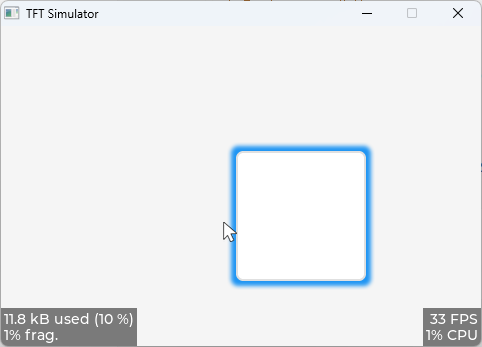

## 基础对象 lv_obj

示例 1.1


```c
void learn_obj(){
    // 声明一个lv_obj 指针
    lv_obj_t * obj1;
    // 创建一个obj对象
    obj1 = lv_obj_create(lv_scr_act());
    // 设置obj对象大小，宽高
    lv_obj_set_size(obj1, 100, 50);
    // 设置对其方式
    lv_obj_align(obj1, LV_ALIGN_CENTER, -60, -30);
}
```

示例 1.2



```c
void learn_obj(){
    // 定义一个阴影对象
    static lv_style_t style_shadow;
    // 初始化阴影
    lv_style_init(&style_shadow);
    // 设置阴影宽度
    lv_style_set_shadow_width(&style_shadow, 10);
    // 设置阴影范围
    lv_style_set_shadow_spread(&style_shadow, 5);
    // 设置阴影颜色
    lv_style_set_shadow_color(&style_shadow, lv_palette_main(LV_PALETTE_BLUE));

    // 声明一个lv_obj 指针
    lv_obj_t * obj2;
    // 创建一个lv_obj对象
    obj2 = lv_obj_create(lv_scr_act());
    // 添加样式风格
    lv_obj_add_style(obj2, &style_shadow, 0);
    // 设置lv_obj对象位置
    lv_obj_align(obj2, LV_ALIGN_CENTER, 60, 30);
}
```

示例 2.1 拖动事件

```c
// 拖动事件
static void drag_event_handler(lv_event_t * e)
{
    // 获取了触发事件的对象指针
    lv_obj_t * obj = lv_event_get_target(e);
    // 获取了当前活动的输入设备（input device）指针
    lv_indev_t * indev = lv_indev_get_act();
    // 检查是否成功获取了当前输入设备指针
    if(indev == NULL)  return;

    // 声明一个二维向量
    lv_point_t vect;
    // 通过设备指针获取当前输入设备的向量信息
    lv_indev_get_vect(indev, &vect);

    // 计算拖动后图形对象的新位置
    lv_coord_t x = lv_obj_get_x(obj) + vect.x;
    lv_coord_t y = lv_obj_get_y(obj) + vect.y;
    // 将新计算得到的坐标应用于图形对象
    lv_obj_set_pos(obj, x, y);
}

void learn_obj(){
    // 声明一个lv_obj 指针
    lv_obj_t * obj;
    // 创建一个lv_obj对象
    obj = lv_obj_create(lv_scr_act());
    // 设置lv_obj的大小(宽和高)
    lv_obj_set_size(obj, 150, 100);
    // 添加拖动时间
    lv_obj_add_event_cb(obj, drag_event_handler, LV_EVENT_PRESSING, NULL);
    // 在lv_obj中创建一个标签
    lv_obj_t * label = lv_label_create(obj);
    // 设置标签内容
    lv_label_set_text(label, "Drag me");
    // 设置标签在lv_obj中位置
    lv_obj_center(label);
}
```

## 圆弧

示例 1


```c
void learn_arc(){
    // 创建一个弧
    lv_obj_t * arc = lv_arc_create(lv_scr_act());
    // 设置弧的宽高是150,150
    lv_obj_set_size(arc, 150, 150);
    // 设置整个圆弧的旋转
    lv_arc_set_rotation(arc, 135);
    // 设置开始和结束角度
    lv_arc_set_bg_angles(arc, 0, 270);
    // 设置开始角度
    lv_arc_set_value(arc, 20);
    // 设置圆弧居中
    lv_obj_center(arc);
}
```

示例 2


```c
static void set_angle(void * obj, int32_t v)
{
    lv_arc_set_value(obj, v);
}

void learn_arc(){
    // 创建一个弧
    lv_obj_t * arc = lv_arc_create(lv_scr_act());
    // 设置整个圆弧的旋转
    lv_arc_set_rotation(arc, 270);
    // 设置开始和结束角度
    lv_arc_set_bg_angles(arc, 0, 360);
    // 移除样式
    lv_obj_remove_style(arc, NULL, LV_PART_KNOB);
    // 清除标志
    lv_obj_clear_flag(arc, LV_OBJ_FLAG_CLICKABLE);
    // 设置居中
    lv_obj_center(arc);

    // 动画
    lv_anim_t a;
    lv_anim_init(&a);
    lv_anim_set_var(&a, arc);
    lv_anim_set_exec_cb(&a, set_angle);
    lv_anim_set_time(&a, 1000);
    lv_anim_set_repeat_count(&a, LV_ANIM_REPEAT_INFINITE);    /*Just for the demo*/
    lv_anim_set_repeat_delay(&a, 500);
    lv_anim_set_values(&a, 0, 100);
    lv_anim_start(&a);
}
```
