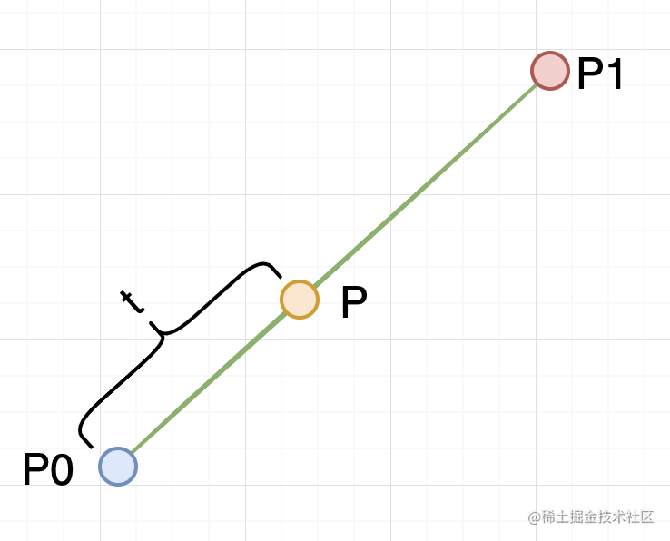
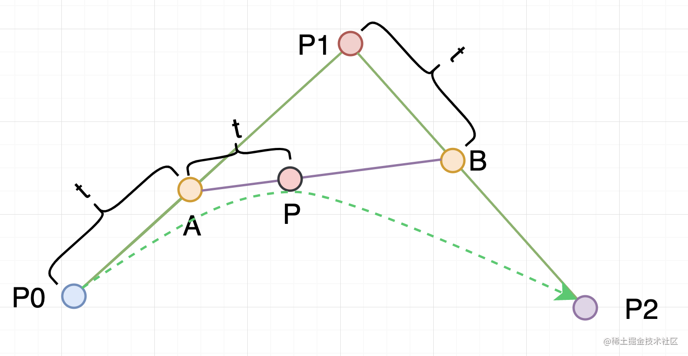
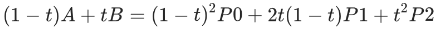
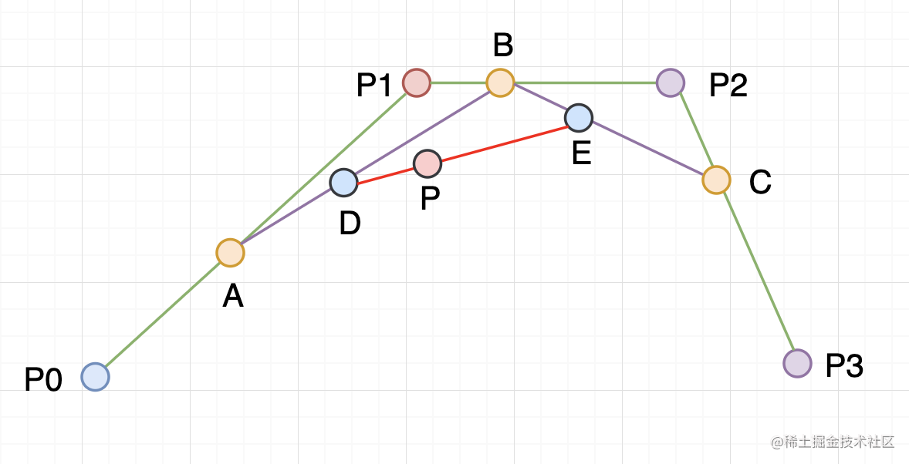
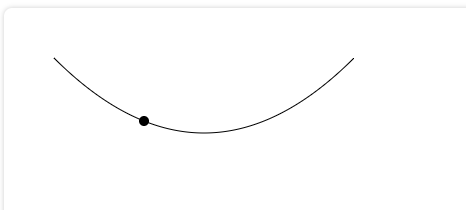
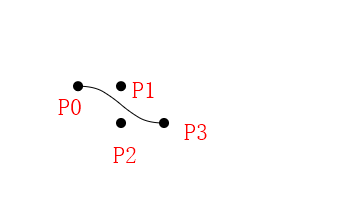

## 一次贝塞尔曲线



P 点随时间 t 在 P0 到 P1 两点之间的线段移动，t=0 时刻，P 点和 P0 重合，t=1 时刻 P 点和 P1 重合。最终推导得到 P 点的位置和 P0，P1 及 t 的关系是一个线性插值函数：


t=0 时 P 点坐标 = (1 - 0)P0 + 0P1 = P0

t=1 时 P 点坐标 = (1-1)P0 + 1P1 = P1

## 二次贝塞尔取曲线

[二次贝塞尔曲线在线测试](http://blogs.sitepointstatic.com/examples/tech/canvas-curves/quadratic-curve.html)



① 求出 A 点坐标(P0 点到 P1 点的一次贝塞尔曲线)，A 点坐标 = (1-t)P0 + tP1

② 求出 B 点坐标(P1 点到 P2 点的一次贝塞尔曲线)，B 点坐标 = (1-t)P1 + tP2

③ 求出 P 点坐标(A 点到 B 点的一次贝塞尔曲线)，P 点坐标 = (1-t)A + tB

化简(1-t)A + tB = (1-t)[(1-t)P0+tP1] + t[(1-t)P1+tP2]



## 三次贝塞尔曲线



第一步

① 求出 A 点坐标(P0 点到 P1 点的一次贝塞尔曲线)，A 点坐标 = (1-t)P0 + tP1

② 求出 B 点坐标(P1 点到 P2 点的一次贝塞尔曲线)，B 点坐标 = (1-t)P1 + tP2

③ 求出 C 点坐标(P2 点到 P3 点的一次贝塞尔曲线)，B 点坐标 = (1-t)P2 + tP3

第二步

① 求出 D 点坐标(A 点到 B 点的一次贝塞尔曲线)，D 点坐标 = (1-t)A + tB

② 求出 E 点坐标(B 点到 C 点的一次贝塞尔曲线)，E 点坐标 = (1-t)B + tC

第三步

求出 P 点坐标(D 点到 E 点的一次贝塞尔曲线)，P 点坐标 = (1-t)D + tE

## 求二次贝塞尔曲线上的点


根据公式写出代码

```js
var ctx = canvas.getContext('2d');
// 绘制一段二次贝塞尔曲线
ctx.moveTo(50, 50);
ctx.quadraticCurveTo(200, 200, 350, 50);
// 绘制
ctx.stroke();

// P0 (50, 50),P1 (200, 200),P2 (350, 50)
const t = 0.3;

const x = (1 - t) * (1 - t) * 50 + 2 * t * (1 - t) * 200 + t * t * 350;
const y = (1 - t) * (1 - t) * 50 + 2 * t * (1 - t) * 200 + t * t * 50;
ctx.beginPath();
ctx.arc(x, y, 5, 0, 2 * Math.PI);
console.log(x, y);
ctx.fill();
```



## 求 P1,P2

P0 起点坐标，P3 结束点坐标是已知的。

P1 的 Y 坐标和 P0 的 Y 坐标一致

P2 的 Y 坐标和 P3 的 Y 坐标一致

只需要求 P1 的 X 轴坐标和 P2 的 X 轴坐标。

P1 的 X 轴坐标和 P2 的 X 轴坐标一致，



```js
// 获取绘图上下文
var ctx = canvas.getContext('2d');

const x1 = 140.0302734375;
const y1 = 252.2;
const x2 = 226.0302734375;
const y2 = 289;
// 绘制一段三次贝塞尔曲线
ctx.moveTo(x1, y1);
ctx.bezierCurveTo(x1 + (x2 - x1) / 2, y1, x1 + (x2 - x1) / 2, y2, x2, y2);
// 绘制
ctx.stroke();

// P0
ctx.beginPath();
ctx.arc(x1, y1, 5, 0, 2 * Math.PI);
ctx.fill();

// P1 (XX,y1)
// 求出中间位置的差值 (x2-x1)/2
// 求X坐标值 x = x1 + (x2-x1)/2
// P1 (x,y1)
ctx.beginPath();
ctx.arc(x1 + (x2 - x1) / 2, y1, 5, 0, 2 * Math.PI);
ctx.fill();

// P2  (XX,y2)
// P2  (x1 + (x2 - x1) / 2,y2)
ctx.beginPath();
ctx.arc(x1 + (x2 - x1) / 2, y2, 5, 0, 2 * Math.PI);
ctx.fill();

// P3
ctx.beginPath();
ctx.arc(x2, y2, 5, 0, 2 * Math.PI);
ctx.fill();
```
