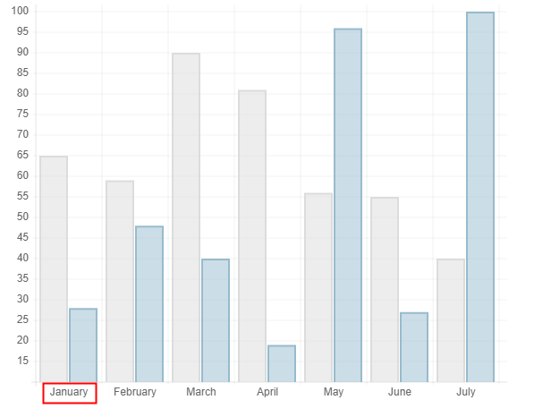
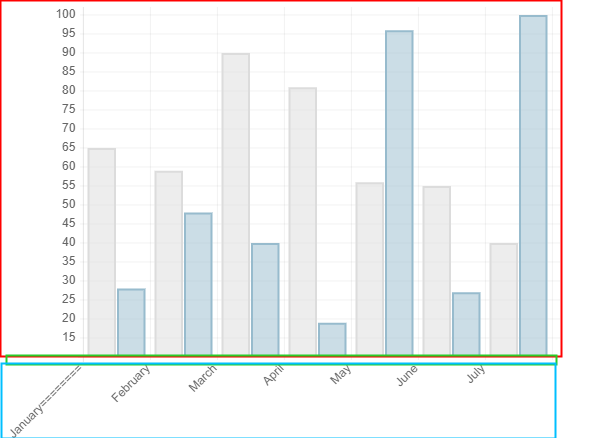
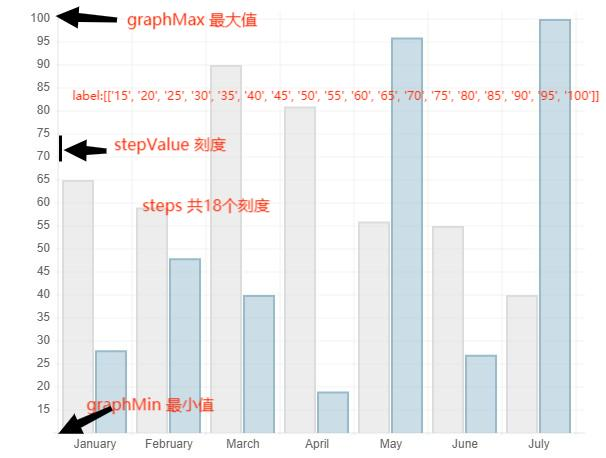
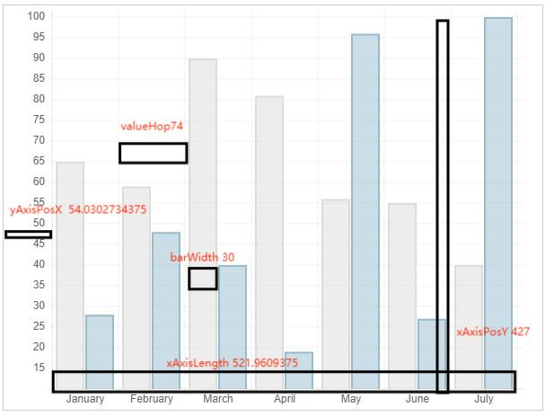
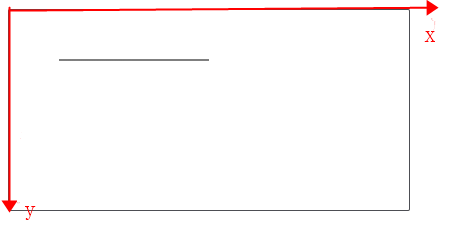
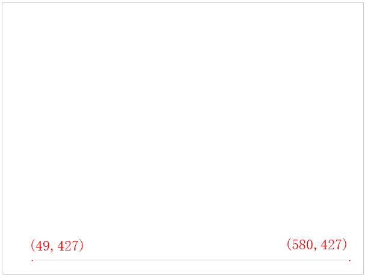
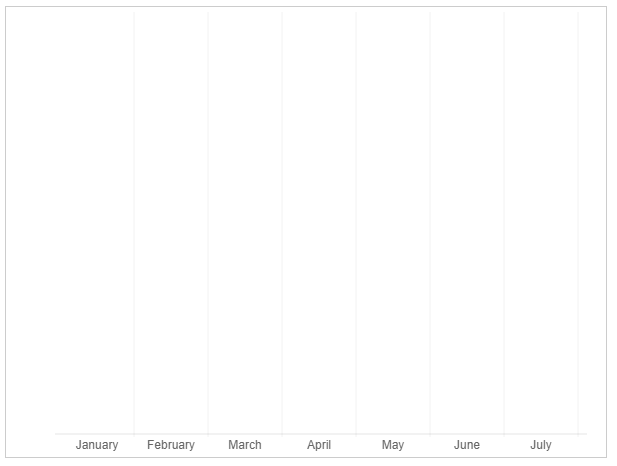
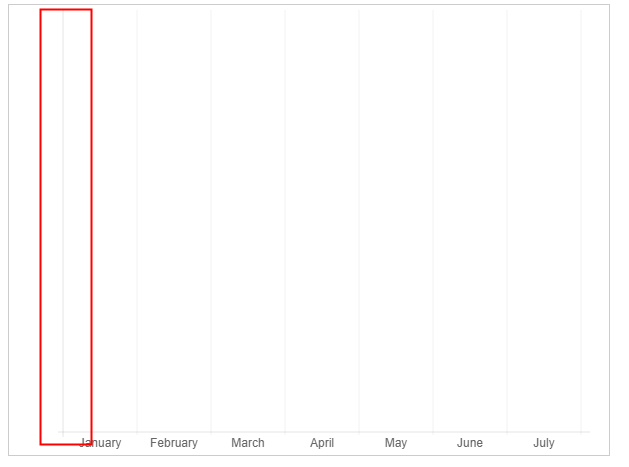
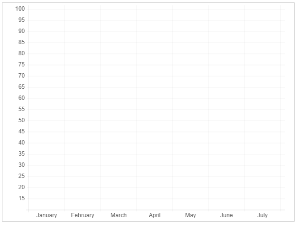
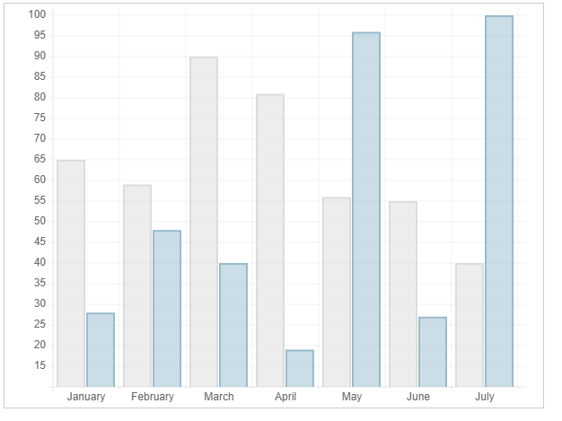

## 计算 label 的最大宽度

[MND](https://developer.mozilla.org/zh-CN/docs/Web/API/CanvasRenderingContext2D/measureText)

测量文本 TextMetrics 对象包含的信息,宽度信息

```js
const canvas = document.getElementById('canvas');
const ctx = canvas.getContext('2d');
const text = ctx.measureText('foo'); // TextMetrics object
text.width; // 16;
```



获取 label 最大宽度

```js
var barChartData = {
  labels: ['January', 'February', 'March', 'April', 'May', 'June', 'July'],
  datasets: [
    {
      fillColor: 'rgba(220,220,220,0.5)',
      strokeColor: 'rgba(220,220,220,1)',
      data: [65, 59, 90, 81, 56, 55, 40],
    },
    {
      fillColor: 'rgba(151,187,205,0.5)',
      strokeColor: 'rgba(151,187,205,1)',
      data: [28, 48, 40, 19, 96, 27, 100],
    },
  ],
};
```

计算最大宽度

```js
// 最大宽度
widestXLabel = 1;

/**
 * 获取文本最大宽度
 * 依次遍历labels所有文本，计算最大的宽度
 */
for (var i = 0; i < data.labels.length; i++) {
  var textLength = ctx.measureText(data.labels[i]).width;
  widestXLabel = textLength > widestXLabel ? textLength : widestXLabel;
}
```

## 计算画布最大高度

当一行不足以放下 label 时需要将 label 倾斜，倾斜后图标高度要重新计算



数据集

```js
var barChartData = {
  labels: [
    'January========',
    'February',
    'March',
    'April',
    'May',
    'June',
    'July',
  ],
  datasets: [
    {
      fillColor: 'rgba(220,220,220,0.5)',
      strokeColor: 'rgba(220,220,220,1)',
      data: [65, 59, 90, 81, 56, 55, 40],
    },
    {
      fillColor: 'rgba(151,187,205,0.5)',
      strokeColor: 'rgba(151,187,205,1)',
      data: [28, 48, 40, 19, 96, 27, 100],
    },
  ],
};
```

实现代码

```js
/**
 * rotateLabels 旋转角度
 */

// 如果所有文字总宽度大于最大宽度就倾斜 45度
if (width / data.labels.length < widestXLabel) {
  // 倾斜45度
  rotateLabels = 45;
  // 如果所有文字倾斜后的总宽度大于最大宽度就倾斜 90度
  if (width / data.labels.length < Math.cos(rotateLabels) * widestXLabel) {
    rotateLabels = 90;
    // 图表高度 = 等于总画布高度 - 文字高度
    maxSize -= widestXLabel;
  } else {
    // 图表高度 = 等于总画布高度 - 文字高度
    maxSize -= Math.sin(rotateLabels) * widestXLabel;
  }
} else {
  // 图表高度 = 等于总画布高度 - 文字高度
  maxSize -= config.scaleFontSize;
}
// 文字和图标之间添加一些边距
maxSize -= 5;
// label高度=字体大小
labelHeight = config.scaleFontSize;
// 减去label高度
maxSize -= labelHeight;
// 高度
scaleHeight = maxSize;
```

## 计算最大最小值


数据集

```js
var barChartData = {
  labels: ['January', 'February', 'March', 'April', 'May', 'June', 'July'],
  datasets: [
    {
      fillColor: 'rgba(220,220,220,0.5)',
      strokeColor: 'rgba(220,220,220,1)',
      data: [65, 59, 90, 81, 56, 55, 40],
    },
    {
      fillColor: 'rgba(151,187,205,0.5)',
      strokeColor: 'rgba(151,187,205,1)',
      data: [28, 48, 40, 19, 96, 27, 100],
    },
  ],
};
```

实现

```js
// 最大值
var upperValue = Number.MIN_VALUE;
// 最小值
var lowerValue = Number.MAX_VALUE;
for (var i = 0; i < data.datasets.length; i++) {
  for (var j = 0; j < data.datasets[i].data.length; j++) {
    if (data.datasets[i].data[j] > upperValue) {
      upperValue = data.datasets[i].data[j];
    }
    if (data.datasets[i].data[j] < lowerValue) {
      lowerValue = data.datasets[i].data[j];
    }
  }
}

console.log('upperValue', upperValue); // 100
console.log('lowerValue', lowerValue); // 19
// 分段数量，图中总共分段18段
// 最多分段
const maxSteps = Math.floor(scaleHeight / (labelHeight * 0.66)); // 53
// 最小分段
const minSteps = Math.floor((scaleHeight / labelHeight) * 0.5); // 17
```

## 刻度计算 scale


### 保留小数位数

`Number.prototype.toFixed()`使用定点表示法来格式化一个数值。[MDN](https://developer.mozilla.org/zh-CN/docs/Web/JavaScript/Reference/Global_Objects/Number/toFixed)

```js
function financial(x) {
  return Number.parseFloat(x).toFixed(2);
}

console.log(financial(123.456));
// expected output: "123.46"

console.log(financial(0.004));
// expected output: "0.00"

console.log(financial('1.23e+5'));
// expected output: "123000.00"
```

获取小数位数

```js
function getDecimalPlaces(num) {
  if (num % 1 != 0) {
    return num.toString().split('.')[1].length;
  } else {
    return 0;
  }
}

console.log('fixed', getDecimalPlaces(1.11)); // 2
console.log('fixed', getDecimalPlaces(1)); // 0
```

### 计算数量级

```js
function calculateOrderOfMagnitude(val) {
  return Math.floor(Math.log(val) / Math.LN10);
}

console.log(calculateOrderOfMagnitude(1)); // 0
console.log(calculateOrderOfMagnitude(10)); // 1
console.log(calculateOrderOfMagnitude(100)); // 1
console.log(calculateOrderOfMagnitude(1000)); // 2
console.log(calculateOrderOfMagnitude(10000)); // 4
```

### 计算刻度相关参数

计算刻度**最小值**，**刻度值**，**总刻度数量**，**刻度文本列表**



```js
// 计算值的范围 maxValue 100,minValue 19
const valueRange = maxValue - minValue; // 81

const graphMin =
  Math.floor(minValue / (1 * Math.pow(10, rangeOrderOfMagnitude))) *
  Math.pow(10, rangeOrderOfMagnitude); // 最小刻度 10

const graphMax =
  Math.ceil(maxValue / (1 * Math.pow(10, rangeOrderOfMagnitude))) *
  Math.pow(10, rangeOrderOfMagnitude); // 最大刻度 100

const graphRange = graphMax - graphMin; // 差值，范围  100 - 10 = 90

// 每一步的进度值
const stepValue = Math.pow(10, rangeOrderOfMagnitude); // 10

// 总刻度数量
const numberOfSteps = Math.round(graphRange / stepValue); // 9

/**
 * minSteps 17,maxSteps 53
 */
while (numberOfSteps < minSteps || numberOfSteps > maxSteps) {
  if (numberOfSteps < minSteps) {
    stepValue /= 2;
    numberOfSteps = Math.round(graphRange / stepValue);
  } else {
    stepValue *= 2;
    numberOfSteps = Math.round(graphRange / stepValue);
  }
}
console.log('stepValue', stepValue); // 5
console.log('numberOfSteps', numberOfSteps); // 18

var labels = [];
for (var i = 1; i < numberOfSteps + 1; i++) {
  labels.push((graphMin + stepValue * i).toFixed(getDecimalPlaces(stepValue)));
}

// ['15', '20', '25', '30', '35', '40', '45', '50', '55', '60', '65', '70', '75', '80', '85', '90', '95', '100']
console.log('labels', labels);
```

## 计算轴线

计算最长文本宽度

```js
var longestText = 1;
//if we are showing the labels
// labels = ['15', '20', '25', '30', '35', '40', '45', '50', '55', '60', '65', '70', '75', '80', '85', '90', '95', '100']
if (config.scaleShowLabels) {
  ctx.font = `${config.scaleFontStyle} ${config.scaleFontSize}px ${config.scaleFontFamily}`;
  for (var i = 0; i < calculatedScale.labels.length; i++) {
    // 计算文本宽度
    var measuredText = ctx.measureText(calculatedScale.labels[i]).width;
    longestText = measuredText > longestText ? measuredText : longestText;
  }
  // 文字之间加一点边距
  longestText += 10;
}

// 最长longestText 宽度
console.log('longestText', longestText); // 30.021484375
```

计算



```js
// 计算x轴的宽度
// canvas宽度 - 最长左侧刻度文本宽度 - 下方名称最长文本宽度
// longestText 左边刻度的最长文本
// widestXLabel 下边名称的最长文本
// 521.9609375
xAxisLength = width - longestText - widestXLabel;
// 每一格的宽度74
valueHop = Math.floor(xAxisLength / data.labels.length);
// 条形图宽度 30
barWidth =
  (valueHop -
    config.scaleGridLineWidth * 2 -
    config.barValueSpacing * 2 -
    (config.barDatasetSpacing * data.datasets.length - 1) -
    ((config.barStrokeWidth / 2) * data.datasets.length - 1)) /
  data.datasets.length;

// y轴所在的x轴坐标 54.0302734375
yAxisPosX = width - widestXLabel / 2 - xAxisLength;
// x轴所在的y轴坐标 427
xAxisPosY = scaleHeight + config.scaleFontSize / 2;
```

## 绘制轴线

### canvas 坐标



```js
var canvas = document.getElementById('canvas');
var ctx = canvas.getContext('2d');

ctx.beginPath();
ctx.moveTo(50, 50);
ctx.lineTo(200, 50);
ctx.stroke();
```

### 绘制 X 轴线



```js
// 设置线宽1，线的颜色
ctx.lineWidth = config.scaleLineWidth;
ctx.strokeStyle = config.scaleLineColor;
ctx.beginPath();
// 画x轴
ctx.moveTo(width - widestXLabel / 2 + 5, xAxisPosY); // (580,427)
ctx.lineTo(width - widestXLabel / 2 - xAxisLength - 5, xAxisPosY); // (49,427)
ctx.stroke();
```

### 绘制文本和网格



```js
ctx.fillStyle = config.scaleFontColor;
for (var i = 0; i < data.labels.length; i++) {
  ctx.save();

  // 文本
  ctx.fillText(
    data.labels[i],
    yAxisPosX + i * valueHop + valueHop / 2,
    xAxisPosY + config.scaleFontSize + 3
  );

  // 画竖网格
  ctx.beginPath();
  ctx.moveTo(yAxisPosX + (i + 1) * valueHop, xAxisPosY + 3);
  ctx.lineWidth = config.scaleGridLineWidth;
  ctx.strokeStyle = config.scaleGridLineColor;
  ctx.lineTo(yAxisPosX + (i + 1) * valueHop, 5);
  ctx.stroke();
}
```

### 绘制 Y 轴线



```js
// 绘制y轴线
ctx.lineWidth = config.scaleLineWidth;
ctx.strokeStyle = config.scaleLineColor;
ctx.beginPath();
ctx.moveTo(yAxisPosX, xAxisPosY + 5);
ctx.lineTo(yAxisPosX, 5);
ctx.stroke();
```

绘制网格和文本



```js
ctx.textAlign = 'right';
ctx.textBaseline = 'middle';
for (var j = 0; j < calculatedScale.steps; j++) {
  ctx.beginPath();
  ctx.moveTo(yAxisPosX - 3, xAxisPosY - (j + 1) * scaleHop);
  if (config.scaleShowGridLines) {
    ctx.lineWidth = config.scaleGridLineWidth;
    ctx.strokeStyle = config.scaleGridLineColor;
    // 绘制横网格
    ctx.lineTo(yAxisPosX + xAxisLength + 5, xAxisPosY - (j + 1) * scaleHop);
  } else {
    ctx.lineTo(yAxisPosX - 0.5, xAxisPosY - (j + 1) * scaleHop);
  }

  ctx.stroke();
  if (config.scaleShowLabels) {
    // 绘制左侧文本
    ctx.fillText(
      calculatedScale.labels[j],
      yAxisPosX - 8,
      xAxisPosY - (j + 1) * scaleHop
    );
  }
}
```

## 绘制条形图

```json
{
  "datasets": [
    {
      "fillColor": "rgba(220,220,220,0.5)",
      "strokeColor": "rgba(220,220,220,1)",
      "data": [65, 59, 90, 81, 56, 55, 40]
    },
    {
      "fillColor": "rgba(151,187,205,0.5)",
      "strokeColor": "rgba(151,187,205,1)",
      "data": [28, 48, 40, 19, 96, 27, 100]
    }
  ]
}
```

绘制条形图



```js
ctx.lineWidth = config.barStrokeWidth;
for (var i = 0; i < data.datasets.length; i++) {
  // 填充颜色
  ctx.fillStyle = data.datasets[i].fillColor;
  // 边框颜色
  ctx.strokeStyle = data.datasets[i].strokeColor;
  for (var j = 0; j < data.datasets[i].data.length; j++) {
    var barOffset =
      yAxisPosX +
      config.barValueSpacing +
      valueHop * j +
      barWidth * i +
      config.barDatasetSpacing * i +
      config.barStrokeWidth * i;

    ctx.beginPath();
    ctx.moveTo(barOffset, xAxisPosY);
    // 绘制左边
    ctx.lineTo(
      barOffset,
      xAxisPosY -
        animPc *
          calculateOffset(data.datasets[i].data[j], calculatedScale, scaleHop) +
        config.barStrokeWidth / 2
    );
    // 绘制顶部
    ctx.lineTo(
      barOffset + barWidth,
      xAxisPosY -
        animPc *
          calculateOffset(data.datasets[i].data[j], calculatedScale, scaleHop) +
        config.barStrokeWidth / 2
    );
    // 绘制右边
    ctx.lineTo(barOffset + barWidth, xAxisPosY);
    if (config.barShowStroke) {
      ctx.stroke();
    }
    ctx.closePath();
    // 填充颜色
    ctx.fill();
  }
}
```

## 缓动方程式

> 自定义参数随时间变化的速率。 现实生活中，物体并不是突然启动或者停止， 当然也不可能一直保持匀速移动。就像我们 打开抽屉的过程那样，刚开始拉的那一下动作很快， 但是当抽屉被拉出来之后我们会不自觉的放慢动作。 或是掉落在地板上的物体，一开始下降的速度很快， 接着就会在地板上来回反弹直到停止。 这个页面将帮助你选择正确的缓动函数。

[官网 ](https://easings.net/zh-cn#)

[github ](https://github.com/ai/easings.net/blob/master/src/easings/easingsFunctions.ts)

```js
var animationOptions = {
  linear: function (t) {
    return t;
  },
  easeInQuad: function (t) {
    return t * t;
  },
  easeOutQuad: function (t) {
    return -1 * t * (t - 2);
  },
  easeInOutQuad: function (t) {
    if ((t /= 1 / 2) < 1) return (1 / 2) * t * t;
    return (-1 / 2) * (--t * (t - 2) - 1);
  },
  easeInCubic: function (t) {
    return t * t * t;
  },
  easeOutCubic: function (t) {
    return 1 * ((t = t / 1 - 1) * t * t + 1);
  },
  easeInOutCubic: function (t) {
    if ((t /= 1 / 2) < 1) return (1 / 2) * t * t * t;
    return (1 / 2) * ((t -= 2) * t * t + 2);
  },
  easeInQuart: function (t) {
    return t * t * t * t;
  },
  easeOutQuart: function (t) {
    return -1 * ((t = t / 1 - 1) * t * t * t - 1);
  },
  easeInOutQuart: function (t) {
    if ((t /= 1 / 2) < 1) return (1 / 2) * t * t * t * t;
    return (-1 / 2) * ((t -= 2) * t * t * t - 2);
  },
  easeInQuint: function (t) {
    return 1 * (t /= 1) * t * t * t * t;
  },
  easeOutQuint: function (t) {
    return 1 * ((t = t / 1 - 1) * t * t * t * t + 1);
  },
  easeInOutQuint: function (t) {
    if ((t /= 1 / 2) < 1) return (1 / 2) * t * t * t * t * t;
    return (1 / 2) * ((t -= 2) * t * t * t * t + 2);
  },
  easeInSine: function (t) {
    return -1 * Math.cos((t / 1) * (Math.PI / 2)) + 1;
  },
  easeOutSine: function (t) {
    return 1 * Math.sin((t / 1) * (Math.PI / 2));
  },
  easeInOutSine: function (t) {
    return (-1 / 2) * (Math.cos((Math.PI * t) / 1) - 1);
  },
  easeInExpo: function (t) {
    return t == 0 ? 1 : 1 * Math.pow(2, 10 * (t / 1 - 1));
  },
  easeOutExpo: function (t) {
    return t == 1 ? 1 : 1 * (-Math.pow(2, (-10 * t) / 1) + 1);
  },
  easeInOutExpo: function (t) {
    if (t == 0) return 0;
    if (t == 1) return 1;
    if ((t /= 1 / 2) < 1) return (1 / 2) * Math.pow(2, 10 * (t - 1));
    return (1 / 2) * (-Math.pow(2, -10 * --t) + 2);
  },
  easeInCirc: function (t) {
    if (t >= 1) return t;
    return -1 * (Math.sqrt(1 - (t /= 1) * t) - 1);
  },
  easeOutCirc: function (t) {
    return 1 * Math.sqrt(1 - (t = t / 1 - 1) * t);
  },
  easeInOutCirc: function (t) {
    if ((t /= 1 / 2) < 1) return (-1 / 2) * (Math.sqrt(1 - t * t) - 1);
    return (1 / 2) * (Math.sqrt(1 - (t -= 2) * t) + 1);
  },
  easeInElastic: function (t) {
    var s = 1.70158;
    var p = 0;
    var a = 1;
    if (t == 0) return 0;
    if ((t /= 1) == 1) return 1;
    if (!p) p = 1 * 0.3;
    if (a < Math.abs(1)) {
      a = 1;
      var s = p / 4;
    } else var s = (p / (2 * Math.PI)) * Math.asin(1 / a);
    return -(
      a *
      Math.pow(2, 10 * (t -= 1)) *
      Math.sin(((t * 1 - s) * (2 * Math.PI)) / p)
    );
  },
  easeOutElastic: function (t) {
    var s = 1.70158;
    var p = 0;
    var a = 1;
    if (t == 0) return 0;
    if ((t /= 1) == 1) return 1;
    if (!p) p = 1 * 0.3;
    if (a < Math.abs(1)) {
      a = 1;
      var s = p / 4;
    } else var s = (p / (2 * Math.PI)) * Math.asin(1 / a);
    return (
      a * Math.pow(2, -10 * t) * Math.sin(((t * 1 - s) * (2 * Math.PI)) / p) + 1
    );
  },
  easeInOutElastic: function (t) {
    var s = 1.70158;
    var p = 0;
    var a = 1;
    if (t == 0) return 0;
    if ((t /= 1 / 2) == 2) return 1;
    if (!p) p = 1 * (0.3 * 1.5);
    if (a < Math.abs(1)) {
      a = 1;
      var s = p / 4;
    } else var s = (p / (2 * Math.PI)) * Math.asin(1 / a);
    if (t < 1)
      return (
        -0.5 *
        (a *
          Math.pow(2, 10 * (t -= 1)) *
          Math.sin(((t * 1 - s) * (2 * Math.PI)) / p))
      );
    return (
      a *
        Math.pow(2, -10 * (t -= 1)) *
        Math.sin(((t * 1 - s) * (2 * Math.PI)) / p) *
        0.5 +
      1
    );
  },
  easeInBack: function (t) {
    var s = 1.70158;
    return 1 * (t /= 1) * t * ((s + 1) * t - s);
  },
  easeOutBack: function (t) {
    var s = 1.70158;
    return 1 * ((t = t / 1 - 1) * t * ((s + 1) * t + s) + 1);
  },
  easeInOutBack: function (t) {
    var s = 1.70158;
    if ((t /= 1 / 2) < 1)
      return (1 / 2) * (t * t * (((s *= 1.525) + 1) * t - s));
    return (1 / 2) * ((t -= 2) * t * (((s *= 1.525) + 1) * t + s) + 2);
  },
  easeInBounce: function (t) {
    return 1 - animationOptions.easeOutBounce(1 - t);
  },
  easeOutBounce: function (t) {
    if ((t /= 1) < 1 / 2.75) {
      return 1 * (7.5625 * t * t);
    } else if (t < 2 / 2.75) {
      return 1 * (7.5625 * (t -= 1.5 / 2.75) * t + 0.75);
    } else if (t < 2.5 / 2.75) {
      return 1 * (7.5625 * (t -= 2.25 / 2.75) * t + 0.9375);
    } else {
      return 1 * (7.5625 * (t -= 2.625 / 2.75) * t + 0.984375);
    }
  },
  easeInOutBounce: function (t) {
    if (t < 1 / 2) return animationOptions.easeInBounce(t * 2) * 0.5;
    return animationOptions.easeOutBounce(t * 2 - 1) * 0.5 + 1 * 0.5;
  },
};
```

## 增加动画

```js
function animationLoop(config, drawScale, drawData, ctx) {
  // config.animation true时，有动画，false时无动画
  // animationSteps 步骤，多少步达到1
  // animationEasing 动画名称
  // percentAnimComplete 0
  // 假定config.animationSteps 60,animFrameAmount = 1/60
  var animFrameAmount = config.animation
    ? 1 / CapValue(config.animationSteps, Number.MAX_VALUE, 1)
    : 1;
  // 动画函数
  var easingFunction = animationOptions[config.animationEasing];
  // 动画完成百分比
  var percentAnimComplete = config.animation ? 0 : 1;

  if (typeof drawScale !== 'function') drawScale = function () {};

  window.requestAnimationFrame(animLoop);

  function animateFrame() {
    var easeAdjustedAnimationPercent = config.animation
      ? CapValue(easingFunction(percentAnimComplete), null, 0)
      : 1;
    clear(ctx);
    if (config.scaleOverlay) {
      drawData(easeAdjustedAnimationPercent);
      // 绘制刻度条
      drawScale();
    } else {
      // 绘制刻度条
      drawScale();
      // 绘制图像传入小数值
      drawData(easeAdjustedAnimationPercent);
    }
  }
  function animLoop() {
    // 加1/60
    percentAnimComplete += animFrameAmount;
    animateFrame();
    //循环调用
    if (percentAnimComplete <= 1) {
      window.requestAnimationFrame(animLoop);
    } else {
      if (typeof config.onAnimationComplete == 'function')
        config.onAnimationComplete();
    }
  }
}
```
