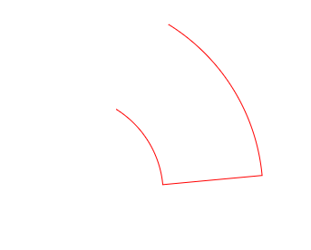
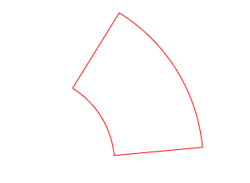
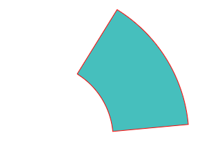
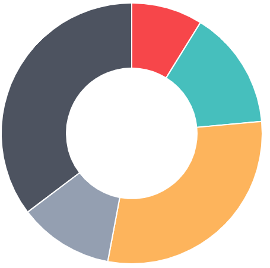

## 数据

```js
var doughnutData = [
  {
    value: 30,
    color: '#F7464A',
  },
  {
    value: 50,
    color: '#46BFBD',
  },
  {
    value: 100,
    color: '#FDB45C',
  },
  {
    value: 40,
    color: '#949FB1',
  },
  {
    value: 120,
    color: '#4D5360',
  },
];
```

## 求总和，半径，切口半径

```js
// 数组中获取最小值
function Min(array) {
  return Math.min.apply(Math, array);
}

// 总和
var segmentTotal = 0;

// 获取饼图半径 -5 留出边距
var doughnutRadius = Min([height / 2, width / 2]) - 5;

// 切口半径 中心空白圆
// percentageInnerCutout 百分比
var cutoutRadius = doughnutRadius * (config.percentageInnerCutout / 100);

// 求总和
for (var i = 0; i < data.length; i++) {
  segmentTotal += data[i].value;
}

// 340
// 30+50+100+40+120 = 340
console.log('segmentTotal', segmentTotal);
```

绘制圆弧

```js
void ctx.arc(x, y, radius, startAngle, endAngle, anticlockwise);
```

x 圆心 x 轴 y 圆心 y 轴 radius 半径 startAngle 起始圆弧 endAngle 结束圆弧 anticlockwise 如果为 `true`，逆时针绘制圆弧，反之，顺时针绘制。

```js
// 绘制弧形 顺时针方向
const a = -1.0163976232202272;
const b = -0.09239978392911152;

ctx.arc(225, 225, 220, a, b, false);
// 从b的位置接着画
ctx.arc(225, 225, 110, b, a, true);
ctx.strokeStyle = 'red';
ctx.stroke();
```



关闭路径后

```js
// 绘制弧形 顺时针方向
const a = -1.0163976232202272;
const b = -0.09239978392911152;

ctx.arc(225, 225, 220, a, b, false);
// 从b的位置接着画
ctx.arc(225, 225, 110, b, a, true);
// 关闭路径
ctx.closePath();
ctx.strokeStyle = 'red';
ctx.stroke();
```



填充颜色

```js
// 绘制弧形 顺时针方向
const a = -1.0163976232202272;
const b = -0.09239978392911152;

ctx.arc(225, 225, 220, a, b, false);
// 从b的位置接着画
ctx.arc(225, 225, 110, b, a, true);
// 关闭路径
ctx.closePath();
ctx.strokeStyle = 'red';
ctx.fillStyle = '#46BFBD';
ctx.fill();
ctx.stroke();
```



## 绘制甜甜圈



```js
// cumulativeAngle 累加角度，-Math.PI / 2 为起始角度
var cumulativeAngle = -Math.PI / 2;

for (var i = 0; i < data.length; i++) {
  // 弧度
  var segmentAngle = (data[i].value / segmentTotal) * (Math.PI * 2);
  console.log('segmentAngle', segmentAngle);
  ctx.beginPath();

  // 绘制外弧度
  ctx.arc(
    width / 2,
    height / 2,
    doughnutRadius,
    cumulativeAngle,
    cumulativeAngle + segmentAngle,
    false
  );

  // 绘制内弧度
  ctx.arc(
    width / 2,
    height / 2,
    cutoutRadius,
    cumulativeAngle + segmentAngle,
    cumulativeAngle,
    true
  );
  ctx.closePath();
  ctx.fillStyle = data[i].color;
  ctx.fill();

  // 绘制边线
  if (config.segmentShowStroke) {
    ctx.lineWidth = config.segmentStrokeWidth;
    ctx.strokeStyle = config.segmentStrokeColor;
    ctx.stroke();
  }
  cumulativeAngle += segmentAngle;
}
```
