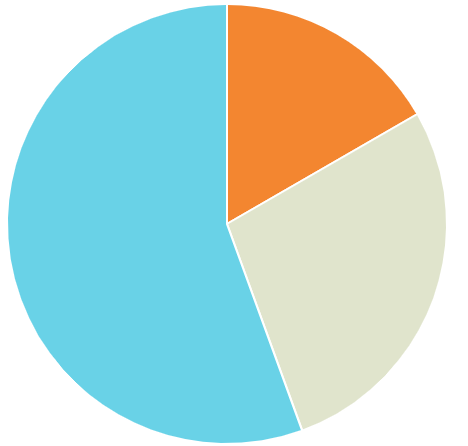

## 数据

```js
var pieData = [
  {
    value: 30,
    color: '#F38630',
  },
  {
    value: 50,
    color: '#E0E4CC',
  },
  {
    value: 100,
    color: '#69D2E7',
  },
];
```

## 求总和，半径

```js
// 总数
var segmentTotal = 0;

//圆的半径
var pieRadius = Min([height / 2, width / 2]) - 5;

for (var i = 0; i < data.length; i++) {
  segmentTotal += data[i].value;
}

// 总数180
// 30 + 50 + 100 = 180
console.log('segmentTotal', segmentTotal);
```

## 绘制饼图



```js
var cumulativeAngle = -Math.PI / 2;
for (var i = 0; i < data.length; i++) {
  // 弧度
  var segmentAngle = (data[i].value / segmentTotal) * (Math.PI * 2);
  ctx.beginPath();
  // 绘制弧形
  ctx.arc(
    width / 2,
    height / 2,
    pieRadius,
    cumulativeAngle,
    cumulativeAngle + segmentAngle
  );
  // 绘制线段
  ctx.lineTo(width / 2, height / 2);
  // 封闭形成扇形
  ctx.closePath();
  ctx.fillStyle = data[i].color;
  ctx.fill();

  if (config.segmentShowStroke) {
    ctx.lineWidth = config.segmentStrokeWidth;
    ctx.strokeStyle = config.segmentStrokeColor;
    ctx.stroke();
  }
  cumulativeAngle += segmentAngle;
}
```
