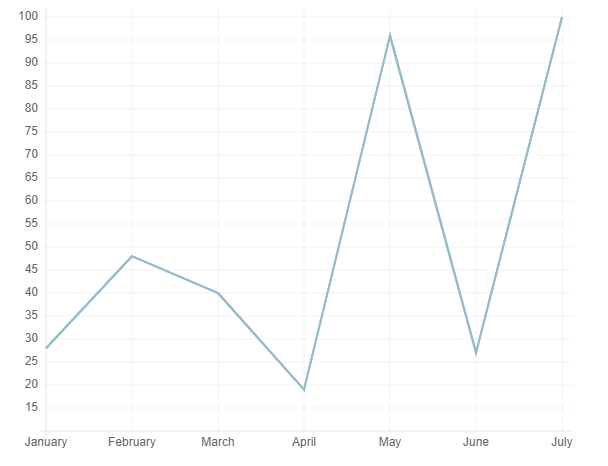
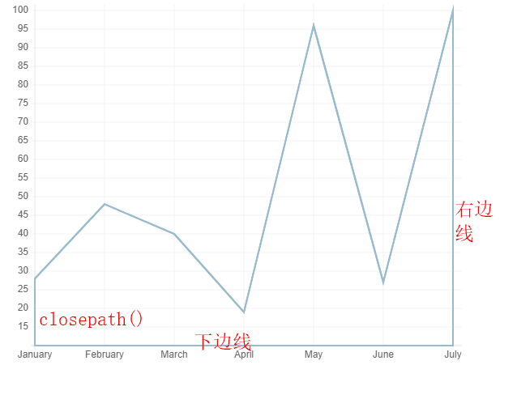
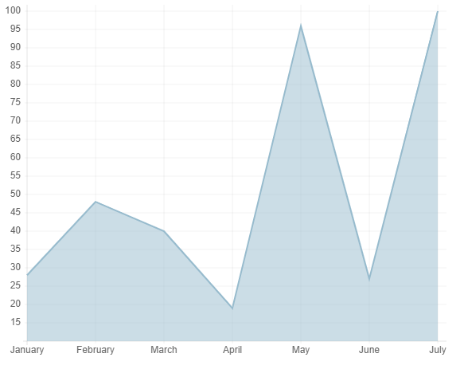
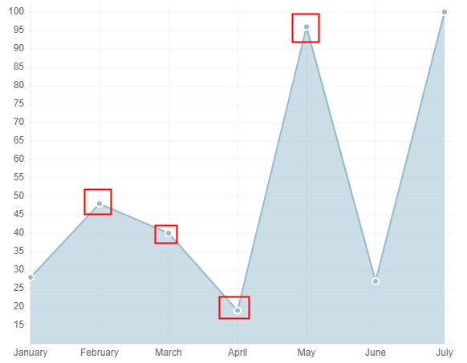

## 数据

```js
var lineChartData = {
  labels: ['January', 'February', 'March', 'April', 'May', 'June', 'July'],
  datasets: [
    {
      fillColor: 'rgba(151,187,205,0.5)',
      strokeColor: 'rgba(151,187,205,1)',
      pointColor: 'rgba(151,187,205,1)',
      pointStrokeColor: '#fff',
      data: [28, 48, 40, 19, 96, 27, 100],
    },
  ],
};
```

## 绘制折线



```js
for (var i = 0; i < data.datasets.length; i++) {
  ctx.strokeStyle = data.datasets[i].strokeColor;
  ctx.lineWidth = config.datasetStrokeWidth;

  ctx.beginPath();
  // 曲线的起始点
  ctx.moveTo(
    yAxisPosX,
    xAxisPosY -
      animPc *
        calculateOffset(data.datasets[i].data[0], calculatedScale, scaleHop)
  );

  // 绘制折线
  for (var j = 1; j < data.datasets[i].data.length; j++) {
    // 绘制折线
    ctx.lineTo(xPos(j), yPos(i, j));
  }
  ctx.stroke();
}
```

## 绘制边线



```js
for (var i = 0; i < data.datasets.length; i++) {
  ctx.strokeStyle = data.datasets[i].strokeColor;
  ctx.lineWidth = config.datasetStrokeWidth;

  ctx.beginPath();
  // 曲线的起始点
  ctx.moveTo(
    yAxisPosX,
    xAxisPosY -
      animPc *
        calculateOffset(data.datasets[i].data[0], calculatedScale, scaleHop)
  );

  // 绘制折线
  for (var j = 1; j < data.datasets[i].data.length; j++) {
    // 绘制折线
    ctx.lineTo(xPos(j), yPos(i, j));
  }
  ctx.stroke();

  // 绘制右边线
  ctx.lineTo(
    yAxisPosX + valueHop * (data.datasets[i].data.length - 1),
    xAxisPosY
  );
  // 绘制下边的线
  ctx.lineTo(yAxisPosX, xAxisPosY);
  ctx.closePath();
  ctx.stroke();
}
```

## 填充颜色



```js
for (var i = 0; i < data.datasets.length; i++) {
  ctx.strokeStyle = data.datasets[i].strokeColor;
  ctx.lineWidth = config.datasetStrokeWidth;

  ctx.beginPath();
  // 曲线的起始点
  ctx.moveTo(
    yAxisPosX,
    xAxisPosY -
      animPc *
        calculateOffset(data.datasets[i].data[0], calculatedScale, scaleHop)
  );

  // 绘制折线
  for (var j = 1; j < data.datasets[i].data.length; j++) {
    // 绘制折线
    ctx.lineTo(xPos(j), yPos(i, j));
  }
  ctx.stroke();

  // 绘制右边线
  ctx.lineTo(
    yAxisPosX + valueHop * (data.datasets[i].data.length - 1),
    xAxisPosY
  );
  // 绘制下边的线
  ctx.lineTo(yAxisPosX, xAxisPosY);
  ctx.closePath();

  // 填充颜色
  ctx.fillStyle = data.datasets[i].fillColor;
  ctx.fill();
}
```

## 绘制圆点



```js
ctx.fillStyle = data.datasets[i].pointColor;
ctx.strokeStyle = data.datasets[i].pointStrokeColor;
ctx.lineWidth = config.pointDotStrokeWidth;
for (var k = 0; k < data.datasets[i].data.length; k++) {
  ctx.beginPath();
  ctx.arc(
    yAxisPosX + valueHop * k,
    xAxisPosY -
      animPc *
        calculateOffset(data.datasets[i].data[k], calculatedScale, scaleHop),
    config.pointDotRadius,
    0,
    Math.PI * 2,
    true
  );
  // 填充颜色
  ctx.fill();
  // 描边
  ctx.stroke();
}
```
