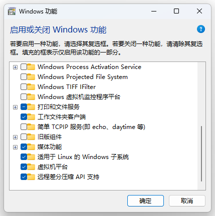
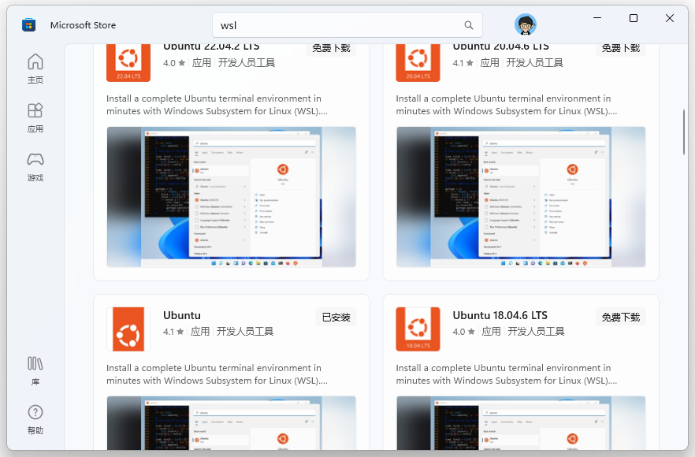
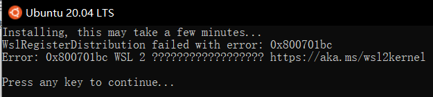
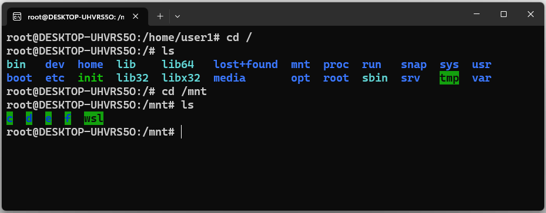

## 1.开启 WSL

在 **控制面板-->程序和功能** 页面找到 **Windows 功能** ，在 **Windows 功能** 窗口中勾选 **适用于 Linux 的 Windows 子系统** 功能，点击确定，并按照提示重启电脑。



## **2.安装喜欢的 WSL 发行版**

在 Windows 应用商店搜索 WSL ，然后搜索栏会提示“在 Windows 上运行 Linux”，点进去，选择自己喜欢的 Linux 发行版，安装即可。这里我选择的是 Ubuntu，之后的所有内容也是基于 WSL Ubuntu 编写。



## 3.解决错误0x800701bc



造成该问题的原因是WSL版本由原来的WSL1升级到WSL2后，内核没有升级，前往微软WSL官网下载安装适用于 x64 计算机的最新 WSL2 Linux 内核更新包即可。

下载链接：https://wslstorestorage.blob.core.windows.net/wslblob/wsl_update_x64.msi

## 3.启用 root 用户

输入以下命令，为 root 用户设置密码：

```bash
$ sudo passwd root
```

## 访问 Windows 下的文件

WSL 可以访问 Windows 文件系统中的文件，WSL 根目录 **/mnt** 目录下有 **c**、**d** 等文件夹，分别表示本地的**C盘**、**D盘** ，直接使用 **cd** 命令，即可访问。



## apt 更换阿里云源

vim 编辑 sources.list ：

```sh
$ sudo vim /etc/apt/sources.list 
```

在 sources.list 中添加 apt 阿里云源：

```sh
deb http://mirrors.aliyun.com/ubuntu/ trusty main restricted universe multiverse
deb http://mirrors.aliyun.com/ubuntu/ trusty-security main restricted universe multiverse
deb http://mirrors.aliyun.com/ubuntu/ trusty-updates main restricted universe multiverse
deb http://mirrors.aliyun.com/ubuntu/ trusty-proposed main restricted universe multiverse
deb http://mirrors.aliyun.com/ubuntu/ trusty-backports main restricted universe multiverse
deb-src http://mirrors.aliyun.com/ubuntu/ trusty main restricted universe multiverse
deb-src http://mirrors.aliyun.com/ubuntu/ trusty-security main restricted universe multiverse
deb-src http://mirrors.aliyun.com/ubuntu/ trusty-updates main restricted universe multiverse
deb-src http://mirrors.aliyun.com/ubuntu/ trusty-proposed main restricted universe multiverse
deb-src http://mirrors.aliyun.com/ubuntu/ trusty-backports main restricted universe multiverse
```

## 更新软件

```sh
$ sudo apt-get update
```

## 安装软件

```sh
sudo apt-get install nodejs
```


