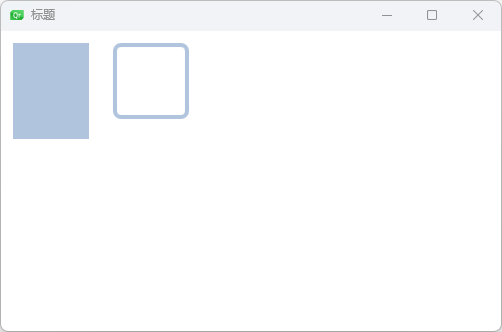
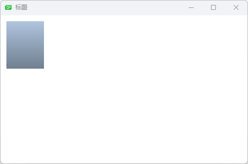
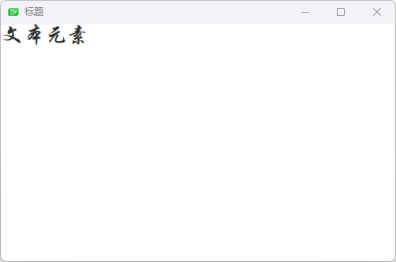
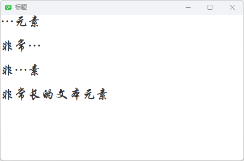
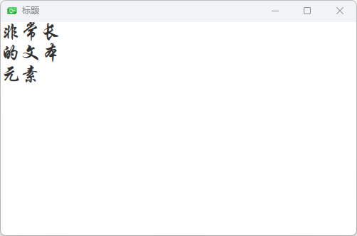
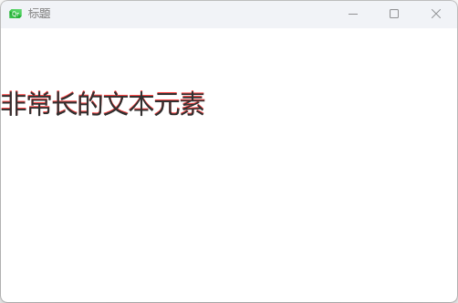
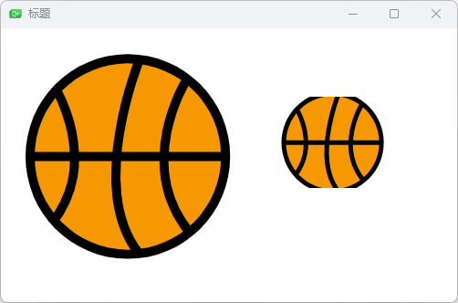
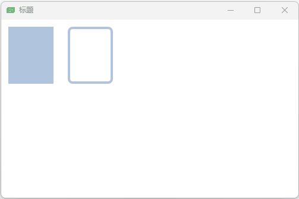

可视化元素，例如 Item（基础元素对象），Rectangle（矩形框），Text（文本），Image（图像）和 MouseArea（鼠标区域）。

## windows 元素

```qml
import QtQuick 2.0

Window {
    width: 640
    height: 480
    visible: true
    title: qsTr("标题")
}
```

## 矩形框元素(Rectangle)

示例一

```qml
import QtQuick 2.0

Window {
    width: 640
    height: 480
    visible: true
    title: qsTr("标题")
    Rectangle{
        id:rect1;
        // 设置坐标
        x: 12; 
        y: 12;
        // 设置宽高
        width: 76;
        height: 96;
        // 设置背景颜色
        color: "lightsteelblue"
    }
    Rectangle{
        id: rect2;
        x: 112;
        y: 12;
        width: 76;
        height: 76;
        // 设置边框颜色
        border.color:"lightsteelblue";
        // 边框宽度
        border.width: 4;
        // 边框圆角
        radius: 8;
    }
}
```



示例二

```qml
import QtQuick 2.0

Window {
    width: 500
    height: 300
    visible: true
    title: qsTr("标题")
    Rectangle{
        id:rect1;
        x: 12; 
        y: 12;
        width: 76;
        height: 96;
        // 定义渐变
        gradient: Gradient{
            GradientStop {
                position: 0.0;
                color: "lightsteelblue";
            }
            GradientStop {
                position: 1.0;
                color: "slategray";
            }
        }
    }
}
```




## 文本元素(Text)

示例一

```qml
import QtQuick 2.0

Window {
    width: 500
    height: 300
    visible: true
    title: qsTr("标题")
    Text{
        text: "文本元素";
        color: "#303030";
        // 设置字体
        font.family:"STXingkai";
        font.pixelSize:28;
    }
}
```



示例二：省略

`elide` 属性允许你设置文本左边，右边或者中间的省略位置。

```qml
import QtQuick 2.0

Window {
    width: 500
    height: 300
    visible: true
    title: qsTr("标题")
    Text{
        width: 100;
        height: 40;
        text: "非常长的文本元素";
        // 超过最长宽度省略：左边省略
        elide: Text.ElideLeft;
        color: "#303030";
        // 设置字体
        font.family:"STXingkai";
        font.pixelSize:28;
    }
    Text{
        width: 100;
        height: 40;
        y:50;
        text: "非常长的文本元素";
        // 超过最长宽度省略：右边省略
        elide: Text.ElideRight;
        color: "#303030";
        // 设置字体
        font.family:"STXingkai";
        font.pixelSize:28;
    }
    Text{
        width: 100;
        height: 40;
        y:100;
        text: "非常长的文本元素";
        // 超过最长宽度省略：中间省略
        elide: Text.ElideMiddle;
        color: "#303030";
        // 设置字体
        font.family:"STXingkai";
        font.pixelSize:28;
    }
    Text{
        width: 100;
        height: 40;
        y:150;
        text: "非常长的文本元素";
        // 不省略
        elide: Text.ElideNone;
        color: "#303030";
        // 设置字体
        font.family:"STXingkai";
        font.pixelSize:28;
    }
}
```



示例三：

换行`wrapMode`属性（这个属性只在明确设置了宽度后才生效）

```qml
import QtQuick 2.0

Window {
    width: 500
    height: 300
    visible: true
    title: qsTr("标题")
    Text{
        width: 100;
        height: 40;
        text: "非常长的文本元素";
        // 超过最长宽度省略：左边省略
        elide: Text.ElideLeft;
        // 设置换行
        wrapMode: Text.WordWrap;
        color: "#303030";
        // 设置字体
        font.family:"STXingkai";
        font.pixelSize:28;
    }
}
```



示例四

`style` 设置文字显示效果，浮雕之类的

`styleColor` 设置文字边框的颜色

`verticalAlignment` 设置文字垂直对齐方式

```qml
import QtQuick 2.0

Window {
    width: 500
    height: 300
    visible: true
    title: qsTr("标题")
    Text{
        width: 100;
        height: 100;
        text: "非常长的文本元素";
        color: "#303030";
        font.pixelSize: 28;
        // 设置文字效果
        style: Text.Sunken;
        // 设置边框颜色
        styleColor: '#FF4444'
        // 设置文字垂直对齐方式
        verticalAlignment: Text.AlignBottom;
    }
}
```



## 图像元素

```qml
import QtQuick 2.0

Window {
    width: 500
    height: 300
    visible: true
    title: qsTr("标题")
    Image{
        x:12;
        y:12;
        // 图片位置
        source:"assets/basketball.png"
    }
    Image{
        x:300;
        y:75;
        width: 128;
        height: 100;
        source:"assets/basketball.png";
        // 填充模式
        fillMode: Image.PreserveAspectCrop;
        // 是否裁切
        clip:true;
    }
}
```



## 鼠标区域元素(MouseArea)

非可视化元素对象

```qml
import QtQuick 2.0

Window {
    width: 500
    height: 300
    visible: true
    title: qsTr("标题")
    Rectangle {
       id: rect1
       x: 12; y: 12
       width: 76; height: 96
       color: "lightsteelblue"
       // 鼠标区域
       MouseArea{
           id: area;
           width: parent.width;
           height: parent.height;
           // 点击事件
           onClicked: rect2.visible = !rect2.visible;
       }
   }

   Rectangle {
       id: rect2
       x: 112; y: 12
       width: 76; height: 96
       border.color: "lightsteelblue"
       border.width: 4
       radius: 8
   }
}
```




