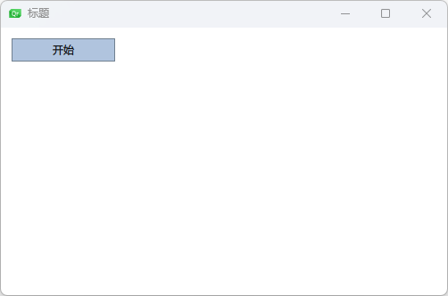
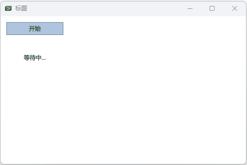

## 创建组件

⼀个以⽂件为基础的组件在⽂件中创建了⼀个`QML`元素，并且将⽂件以 元素类型来命名（例如`Button.qml`）。你可以像任何其它的`QtQuick`模块中使 ⽤**元素**⼀样来使⽤这个组件。

```qml
// Button.qml
import QtQuick 2.0
Rectangle {
    id:button
    x:12;
    y:12;
    width: 116;
    height: 26;
    color: "lightsteelblue";
    border.color: "slategrey";
    Text {
        anchors.centerIn: parent;
        text: "开始";
    }
} 
```

直接使用不用导入

```qml
// Main.qml
import QtQuick 2.0

Window {
    width: 500
    height: 300
    visible: true
    title: qsTr("标题")
    Button{
        id:btn;
    }
}
```




## 组件的参数

定义`text` 参数 和 `myClicked`

```qml
import QtQuick 2.0

// Button.qml

Rectangle {
    id:r;
    // 暴露button参数
    property alias text: label.text;
    signal myClicked;
    width: 116;
    height: 26;
    color: "lightsteelblue";
    border.color: "slategrey";
    Text {
        id:label;
        anchors.centerIn: parent;
        text: "";
    }
    MouseArea{
        anchors.fill: parent;
        onClicked: {
            r.myClicked();
        }
    }
}
```

传递参数

```qml
import QtQuick 2.0

Window {
    width: 500
    height: 300
    visible: true
    title: qsTr("标题")
    Button{
        id:btn;
        x:12;
        y:12;
        text: "开始";
        onMyClicked: {
            status.text = "按钮被点击"
        }
    }
    Text {
        id: status;
        x:12;
        y:76;
        width: 116;
        height: 26;
        text: "等待中...";
        horizontalAlignment: Text.AlignHCenter;
    }
}
```




