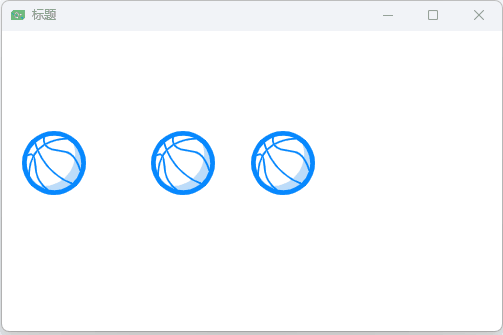
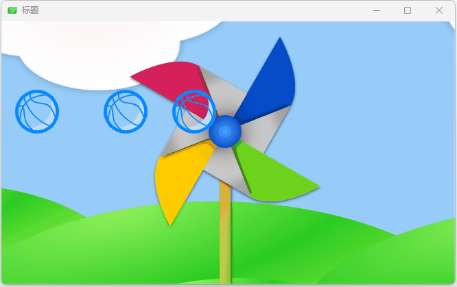

## 简单转换

坐标移动、放大缩小

```qml
import QtQuick 2.0

// ClickableImage.qml

Image {
    id:root;
    signal clicked;
    MouseArea{
        anchors.fill: parent;
        onClicked: root.clicked();
    }
}
```

测试

```qml
import QtQuick 2.0

Window {
    width: 500
    height: 300
    visible: true
    title: qsTr("标题")
    // 坐标移动
    ClickableImage{
        id:basketball1;
        x:20;
        y:100;
        source: "assets/basketball.png";
        onClicked: {
            x += 5;
        }
    }
	// 旋转
    ClickableImage{
        id:basketball2;
        x:149;
        y:100;
        source: "assets/basketball.png";
        onClicked: {
            rotation += 5;
        }
    }
    // 旋转+缩放
    ClickableImage{
        id:basketball3;
        x:249;
        y:100;
        source: "assets/basketball.png";
        onClicked: {
            rotation += 5;
            scale -= 0.05;
        }
    }
}
```



## 背景区域

```qml
import QtQuick 2.0

Window {
    width: bg.width;
    height: bg.height;
    visible: true
    title: qsTr("标题")

    // 增加背景
    Image{
        id:bg
        source: "assets/bg.png"
    }

    // 覆盖整个区域
    MouseArea{
        id: backgroudClicker;
        anchors.fill: parent;
        onClicked: {
            basketball1.x = 20;
            basketball2.rotation = 0;
            basketball3.rotation = 0;
            basketball3.scale = 1.0;
        }
    }

    ClickableImage{
        id:basketball1;
        x:20;
        y:100;
        source: "assets/basketball.png";
        onClicked: {
            x += 5;
        }
    }

    ClickableImage{
        id:basketball2;
        x:149;
        y:100;
        source: "assets/basketball.png";
        onClicked: {
            rotation += 5;
        }
    }

    ClickableImage{
        id:basketball3;
        x:249;
        y:100;
        source: "assets/basketball.png";
        onClicked: {
            rotation += 5;
            scale -= 0.05;
        }
    }
}
```




