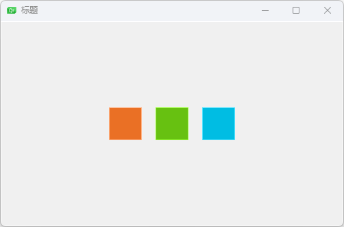
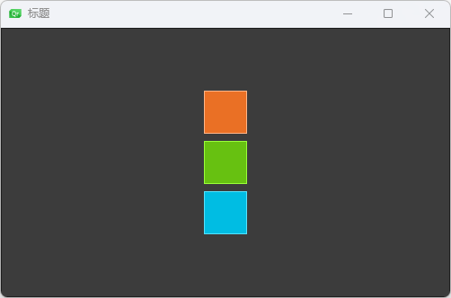
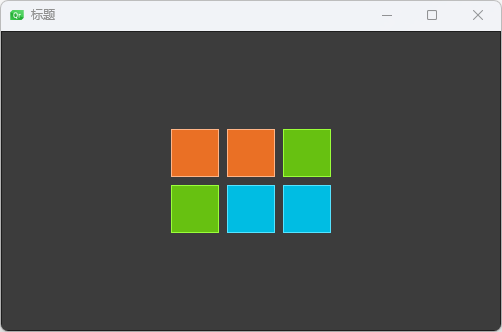
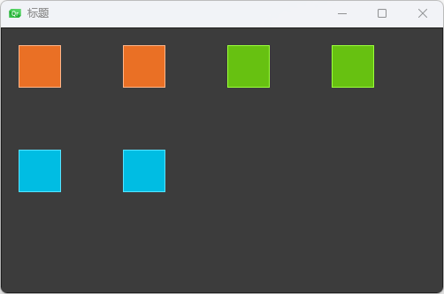
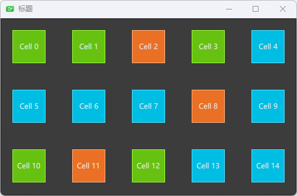

## 颜色块组件

红块

```qml
// RedSquare.qml

import QtQuick 2.0

Rectangle {
    width: 48;
    height: 48;
    color: "#ea7025";
    // lighter使用color的颜色生成高亮度的颜色
    border.color: Qt.lighter(color);
}
```

绿块

```qml
// GreenSquare.qml

import QtQuick 2.0

Rectangle {
    width: 48
    height: 48
    color: "#67c111"
    border.color: Qt.lighter(color)
}
```

蓝块

```qml
// BlueSquare.qml
import QtQuick 2.0

Rectangle {
    width: 48
    height: 48
    color: "#00bde3"
    border.color: Qt.lighter(color)
}
```

白块

```qml
// BrightSquare.qml

import QtQuick 2.0

Rectangle {
    width: 48
    height: 48
    color: "#f0f0f0"
    border.color: Qt.lighter(color)
}
```

黑块

```qml
// DarkSquare.qml
import QtQuick 2.0

Rectangle {
    width: 48
    height: 48
    color: "#3c3c3c"
    border.color: Qt.darker(color)
}
```

## 行定位(Row)

```qml
import QtQuick 2.0

Window {
    width: root.width;
    height: root.height;
    visible: true
    title: qsTr("标题")
    BrightSquare{
        id:root;
        width: 500;
        height: 300;
        // 行定位
        Row{
            id: row;
            anchors.centerIn: parent;
            // 间隔
            spacing: 20;
            RedSquare {

            }
            GreenSquare{

            }
            BlueSquare{

            }
        }
    }
}
```



## 列定位(Column)

```qml
import QtQuick 2.0

Window {
    width: root.width;
    height: root.height;
    visible: true
    title: qsTr("标题")
    DarkSquare{
        id:root;
        width: 500;
        height: 300;
        // 列定位
        Column{
            id: column;
            anchors.centerIn: parent;
            // 间隔
            spacing: 8;
            RedSquare {

            }
            GreenSquare{

            }
            BlueSquare{

            }
        }
    }
}
```



## 栅格(Grid)

```qml
import QtQuick 2.0

Window {
    width: root.width;
    height: root.height;
    visible: true
    title: qsTr("标题")
    DarkSquare{
        id:root;
        width: 500;
        height: 300;
        // 栅格
        Grid{
            id: grid;
            // 行数
            rows:2;
            // 列数
            columns:3;
            anchors.centerIn: parent;
            // 间隔
            spacing: 8;
            RedSquare {

            }
            RedSquare {

            }
            GreenSquare{

            }
            GreenSquare{

            }
            BlueSquare{

            }
            BlueSquare{

            }
        }
    }
}
```




## 流(Flow)

```qml
import QtQuick 2.0

Window {
    width: root.width;
    height: root.height;
    visible: true
    title: qsTr("标题")
    DarkSquare{
        id:root;
        width: 500;
        height: 300;
        // 流
        Flow{
            anchors.fill: parent;
            anchors.margins: 20;
            // 间隔
            spacing: 70;
            RedSquare {

            }
            RedSquare {

            }
            GreenSquare{

            }
            GreenSquare{

            }
            BlueSquare{

            }
            BlueSquare{

            }
        }
    }
}
```



## 重复元素(Repeater)

通常Repeater（重复元素）与定位器⼀起使⽤。它的⼯作⽅式就像for循环与 迭代器的模式⼀样。

```qml
import QtQuick 2.0

Window {
    width: root.width;
    height: root.height;
    visible: true
    title: qsTr("标题")
    DarkSquare{
        id:root;
        width: 500;
        height: 300;
        property variant colorArray:  ["#00bde3", "#67c111", "#ea7025"]
        // 流
        Flow{
            anchors.fill: parent;
            anchors.margins: 20;
            // 间隔
            spacing: 45;
            Repeater{
                model: 15;
                Rectangle{
                    width: 56;
                    height: 56;
                    property int colorIndex: Math.floor(Math.random()*3);
                    color: root.colorArray[colorIndex]
                    border.color: Qt.lighter(color);
                    Text{
                        anchors.centerIn: parent;
                        color: "#f0f0f0";
                        text: "Cell "+ index;
                    }
                }
            }
        }
    }
}
```




