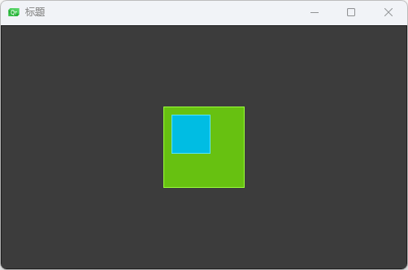

QML 使⽤ anchors（锚）对元素进⾏布局。anchoring（锚定）是基础元素对象的基本属性，可以被所有的可视化 QML 元素使⽤。⼀个 anchors（锚）就像⼀个协议，并且⽐⼏何变化更加强⼤。Anchors（锚）是相对关系的表达式，你通常需要与其它元素搭配使⽤。

## 填充

```qml
import QtQuick 2.0

Window {
    width: root.width;
    height: root.height;
    visible: true
    title: qsTr("标题")
    DarkSquare{
        id:root;
        width: 500;
        height: 300;
        GreenSquare{
            width: 100;
            height: 100;
            anchors.centerIn: parent;
            BlueSquare{
                // 这个宽度无效
                width: 0;
                // 填充父元素
                anchors.fill: parent;
                // 外边距
                anchors.margins: 10;
            }
        }
    }
}
```


## 左对齐

```qml
import QtQuick 2.0

Window {
    width: root.width;
    height: root.height;
    visible: true
    title: qsTr("标题")
    DarkSquare{
        id:root;
        width: 500;
        height: 300;
        GreenSquare{
            width: 100;
            height: 100;
            anchors.centerIn: parent;
            BlueSquare{
                // 宽度
                width: 48;
                // 距离父元素y轴10
                y:10;
                // 左对齐父元素
                anchors.left: parent.left;
                // 左外边距
                anchors.leftMargin: 10;
            }
        }
    }
}
```




## 右对齐

左边与父元素的右边对齐

```qml
import QtQuick 2.0

Window {
    width: root.width;
    height: root.height;
    visible: true
    title: qsTr("标题")
    DarkSquare{
        id:root;
        width: 500;
        height: 300;
        GreenSquare{
            width: 100;
            height: 100;
            anchors.centerIn: parent;
            BlueSquare{
                // 宽度
                width: 48;
                // 左边与父元素的右边对齐
                anchors.left: parent.right;
            }
        }
    }
}
```


右边与父元素的右边对齐

```qml
import QtQuick 2.0

Window {
    width: root.width;
    height: root.height;
    visible: true
    title: qsTr("标题")
    DarkSquare{
        id:root;
        width: 500;
        height: 300;
        GreenSquare{
            width: 100;
            height: 100;
            anchors.centerIn: parent;
            BlueSquare{
                // 宽度
                width: 48;
                // 右边与父元素的右边对齐
                anchors.right: parent.right;
            }
        }
    }
}
```


## 中间对齐

`horizontalCenter` 水平居中

`verticalCenter` 垂直居中

```qml
import QtQuick 2.0

Window {
    width: root.width;
    height: root.height;
    visible: true
    title: qsTr("标题")
    DarkSquare{
        id:root;
        width: 500;
        height: 300;
        GreenSquare{
            width: 100;
            height: 100;
            anchors.centerIn: parent;
            BlueSquare{
                id:blue;
                // 宽度
                width: 80;
                // 在GreenSquare水平居中
                anchors.horizontalCenter: parent.horizontalCenter;
            }
            RedSquare{
                id:red;
                // 宽度
                width:30;
                // 在blue水平居中
                anchors.horizontalCenter: blue.horizontalCenter;
            }
        }
    }
}
```


## 偏移

⽔平⽅向居中对⻬⽗元素并向后偏移12像素

```qml
import QtQuick 2.0

Window {
    width: root.width;
    height: root.height;
    visible: true
    title: qsTr("标题")
    DarkSquare{
        id:root;
        width: 500;
        height: 300;
        GreenSquare{
            width: 100;
            height: 100;
            anchors.centerIn: parent;
            BlueSquare{
                id:blue;
                // 宽度
                width: 48;
                // 在GreenSquare水平居中
                anchors.horizontalCenter: parent.horizontalCenter;
                // 偏移12像素
                anchors.horizontalCenterOffset: 12;
            }
        }
    }
}
```


