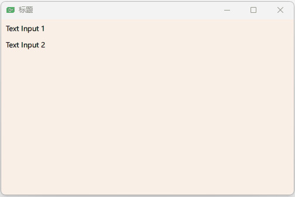
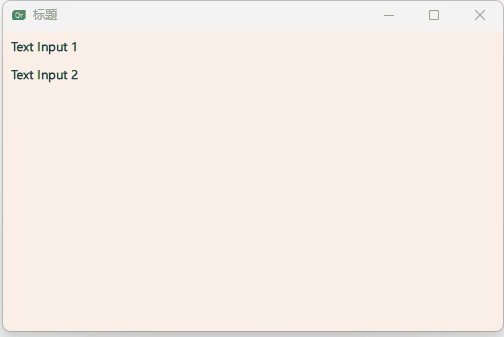
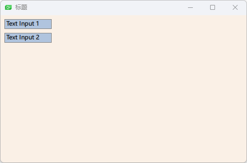
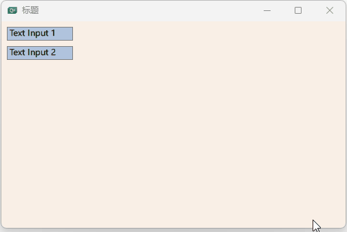
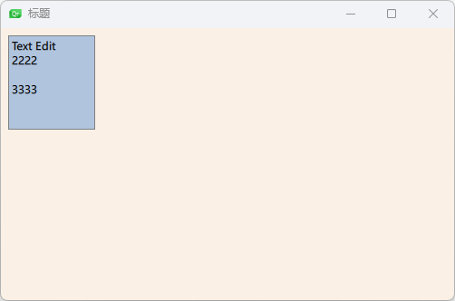
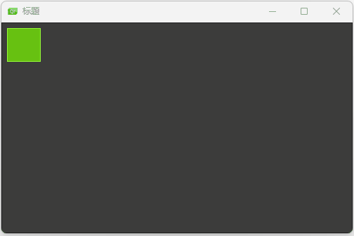
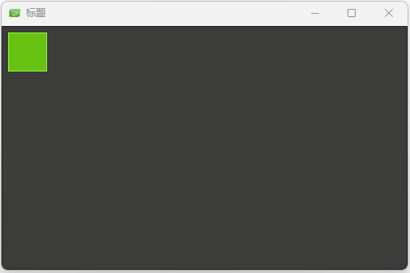

## ⽂本输⼊（TextInput）

示例一

```qml
import QtQuick 2.0

Window {
    width: 500;
    height: 300;
    visible: true
    title: qsTr("标题")
    color: "linen"
    TextInput{
        id:input;
        x:8;
        y:8;
        width: 96;
        height: 20;
        focus: true;
        text: "Text Input 1"

    }

    TextInput {
        id: input2
        x: 8; y: 36
        width: 96; height: 20
        text: "Text Input 2"
    }

}
```



使⽤KeyNavigation（按键向导）这个附加属性来获取焦点。

按TAB键切换焦点

```qml
import QtQuick 2.0

Window {
    width: 500;
    height: 300;
    visible: true
    title: qsTr("标题")
    color: "linen"
    TextInput{
        id:input1;
        x:8;
        y:8;
        width: 96;
        height: 20;
        focus: true;
        text: "Text Input 1"
        KeyNavigation.tab: input2;
    }

    TextInput {
        id: input2
        x: 8; y: 36
        width: 96; height: 20
        text: "Text Input 2"
        KeyNavigation.tab: input1;
    }

}
```




⼀个⽂本输⼊元素（text input element）只显⽰⼀个闪烁符和已经输⼊的⽂ 本。⽤户需要⼀些可⻅的修饰来鉴别这是⼀个输⼊元素，例如⼀个简单的矩 形框。当你放置⼀个TextInput（⽂本输⼊）在⼀个元素中时，你需要确保其 它的元素能够访问它导出的⼤多数属性。

```qml
// TLineEditV1.qml

import QtQuick 2.0

Rectangle {
    width: 96;
    height: input.height + 8;
    color:  "lightsteelblue";
    border.color: "gray"
    property alias text: input.text
    property alias input: input
    TextInput{
        id:input;
        anchors.fill: parent;
        anchors.margins: 4;
        focus: true;
    }
}
```

重新table切换

```qml
import QtQuick 2.0

Window {
    width: 500;
    height: 300;
    visible: true
    title: qsTr("标题")
    color: "linen"
    TLineEditV1{
        id:input1;
        x:8;
        y:8;
        width: 96;
        height: 20;
        KeyNavigation.tab: input2;
        text: "Text Input 1"
    }
    TLineEditV1 {
        id: input2
        x: 8; y: 36
        width: 96; height: 20
        KeyNavigation.tab: input1;
        text: "Text Input 2"
    }
}
```



TAB键切换失败，为了防⽌这个问题，QML提供了FocusScope（焦 点区域）。

##  焦点区域（FocusScope）

⼀个焦点区域（focus scope）定义了如果焦点区域接收到焦点，它的最后⼀ 个使⽤focus:true的⼦元素接收焦点，它将会把焦点传递给最后申请焦点的⼦ 元素。我们创建了第⼆个版本的TLineEdit组件，称作TLineEditV2，使⽤焦 点区域（focus scope）作为根元素。

```qml
// TLineEditV1.qml

import QtQuick 2.0

FocusScope {
    width: 96;
    height: input.height + 8;
    Rectangle{
        color:  "lightsteelblue";
        border.color: "gray"
        anchors.fill: parent;
    }

    property alias text: input.text
    property alias input: input
    TextInput{
        id:input;
        anchors.fill: parent;
        anchors.margins: 4;
        focus: true;
    }
}
```

TAB键切换测试

```qml
import QtQuick 2.0

Window {
    width: 500;
    height: 300;
    visible: true
    title: qsTr("标题")
    color: "linen"
    TLineEditV1{
        id:input1;
        x:8;
        y:8;
        width: 96;
        height: 20;
        // 切换到input2
        KeyNavigation.tab: input2;
        text: "Text Input 1"
    }
    TLineEditV1 {
        id: input2
        x: 8; y: 36
        width: 96; height: 20
        // 切换到input1
        KeyNavigation.tab: input1;
        text: "Text Input 2"
    }
}
```



## ⽂本编辑（TextEdit）

⽂本编辑（TextEdit）元素与⽂本输⼊（TextInput）⾮常类似，它⽀持多⾏ ⽂本编辑。它不再⽀持⽂本输⼊的限。

```qml
// TTextEdit.qml

import QtQuick 2.0

FocusScope {
    width: 96;
    height: 96;
    Rectangle{
        anchors.fill: parent;
        color: "lightsteelblue";
        border.color: "gray";
    }

    property alias text: input.text;
    property alias input: input

    TextEdit{
        id: input;
        anchors.fill: parent;
        anchors.margins: 4;
        focus: true;
    }
}
```

多行输入测试

```qml
import QtQuick 2.0

Window {
    width: 500;
    height: 300;
    visible: true
    title: qsTr("标题")
    color: "linen"
    TTextEdit{
        id:input1;
        x:8;
        y:8;
        width: 96;
        height: 104;
        focus: true;
        text: "Text Edit"
    }
}
```



## 按键元素（Key Element）

附加属性key允许你基于某个按键的点击来执⾏代码。例如使⽤up，down按 键来移动⼀个⽅块，left，right按键来旋转⼀个元素，plus，minus按键来缩 放⼀个元素。

```qml
import QtQuick 2.0

Window {
    width: 500;
    height: 300;
    visible: true
    title: qsTr("标题")
    color: "linen"
    DarkSquare{
        anchors.fill: parent;
        GreenSquare{
            id: square;
            x:8;
            y:8;
        }
        focus: true;
        // 左键
        Keys.onLeftPressed: square.x -= 8;
        Keys.onRightPressed: square.x += 8;
        Keys.onUpPressed: square.y -= 8;
        Keys.onDownPressed: square.y += 8;
        Keys.onPressed: {
            switch(event.key){
                case Qt.Key_Plus:
                    square.scale += 0.2;
                    break;
                case Qt.Key_Minus:
                    square.scale -= 0.2;
                    break;
            }
        }
    }
}
```




示例二

```qml
import QtQuick 2.0

Window {
    width: 500;
    height: 300;
    visible: true
    title: qsTr("标题")
    color: "linen"
    DarkSquare{
        anchors.fill: parent;
        GreenSquare{
            id: square;
            x:8;
            y:8;
        }
        focus: true;
        // 左键
        Keys.onLeftPressed: {
            square.x -= 8;
            text.text = "Left"
        }

        Keys.onRightPressed: {
            square.x += 8;
            text.text = "Right"
        }

        Keys.onUpPressed: {
            square.y -= 8;
            text.text = "Up"
        }

        Keys.onDownPressed: {
            square.y += 8;
            text.text = "Down"
        }

        Keys.onPressed: {
            switch(event.key){
                case Qt.Key_Plus:
                    square.scale += 0.2;
                    text.text = "+"
                    break;
                case Qt.Key_Minus:
                    square.scale -= 0.2;
                    text.text = "-"
                    break;
            }
        }

        Text{
            id:text;
            anchors.right: parent.right;
            anchors.bottom: parent.bottom;
            anchors.margins: 10;
            color: "#fff";
            font.pixelSize: 30;
        }
    }
}
```




