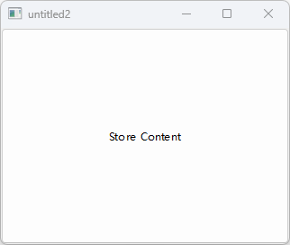

## 基本程序

### 1.定义主窗口

只有加入了Q_OBJECT，你**才能使用QT中的signal和slot机制**。为了使用信号和槽,就必须继承Q_OBJECT.

```qml
#ifndef MAINWINDOW_H
#define MAINWINDOW_H

#include <QtWidgets>

// 声明主窗口
class MainWindow:public QMainWindow
{
    Q_OBJECT
public:
    MainWindow(QWidget* parent = 0);
    ~MainWindow();
public slots:
    // 声明storeContent插槽
    void storeContent();
private:
    QPushButton *m_button;
};

#endif
```

### 2.实现主窗口

```qml
#include "mainwindow.h"

MainWindow::MainWindow(QWidget *parent):QMainWindow(parent){
    // 创建一个button
    m_button = new QPushButton("Store Content",this);
    setCentralWidget(m_button);
    connect(m_button,&QPushButton::clicked,this,&MainWindow::storeContent);
}

MainWindow::~MainWindow(){

}
// 定义插槽方法
void MainWindow::storeContent(){
    qDebug() << "... store content";
    QString message("Hello world!");
    // 在用户目录下创建一个文件
    QFile file(QDir::home().absoluteFilePath("out.txt"));

    if(!file.open(QIODevice::WriteOnly)){
        qWarning() << "Can not open file with wrtie access";
        return;
    }
    QTextStream stream(&file);
    stream << message;
}
```

### 3.加入到主窗口

```qml
#include <QtCore>
#include <QtGui>
#include <QtWidgets>
#include "mainwindow.h"

int main(int argc, char** argv){
    QApplication app(argc,argv);
    // 创建一个主窗口
    MainWindow win;
    // 设置主窗口大小为320,240
    win.resize(320,240);
    // 设置窗口可见
    win.setVisible(true);
    return app.exec();
}
```



## QT通用类

### 字符串

示例一：字符串转换

```cpp
void FoundationTest::testQString()
{
    // 创建一个string
    QString data("A,B,C,D");
    // 拆分为数组
    QStringList list = data.split(",");
    // 合并为字符串
    QString out = list.join(",");
    // 验证是否相等
    QVERIFY(data == out);
    // 改变首字母为大写
    QVERIFY(QString("A") == out[0].toUpper());
}
```

示例二：字符串和数字互转

```cpp
void FoundationTest::testQNumbers(){
    // 要转换的值
    int v = 10;
    // 进制 10进制
    int base = 10;
    // 将int类型转换为字符串
    QString a = QString::number(v, base);
    // 用于检测是否转换成功
    bool ok(false);
    // 转换后的值
    int v2 = a.toInt(&ok, base);
    // 验证输出的结果
    QVERIFY(ok == true);
    QVERIFY(v == v2);
}
```

示例三：字符串参数

```cpp
void FoundationTest::testStringArg(){
    QString name("Joe");
    // 获取周几并转换为字符串
    QString weekday = QDate::currentDate().toString("dddd");
    // 字符串参数
    QString hello = QString("Hello %1. Today is %2.").arg(name).arg(weekday);
    //判断是否是星期一
    if(Qt::Monday == QDate::currentDate().dayOfWeek()){
        QCOMPARE(QString("Hello Joe. Today is Monday."),hello);
    }else{
        QVERIFY(QString("Hello Joe. Today is Monday.")!= hello);
    }
}
```

示例三：unicode编码

```cpp
void FoundationTest::testUnicode(){
    // 创建一个unicode
    QChar smile(0x263A);
    qDebug() << smile;
    // 通过字符串创建一个unicode
    QChar smile2 = QString("\u263A").at(0);
    // 验证是否相等
    QVERIFY(smile == smile2);
    // 创建vector容器
    QVector<QChar> smilies(12);
    // 填充12次smile
    smilies.fill(smile);
    qDebug() << smilies;
}
```

### 顺序容器

```cpp
void FoundationTest::testContainer(){
    // 创建一个int类型容器
    QList<int> list{1,2};
    // 追加一个3
    list << 3;
    qDebug() << list; // QList(1, 2, 3)
    // QT方式迭代并求和
    {
        int sum(0);
        foreach (int v, list) {
            sum += v;
        }
        QVERIFY(sum == 6);
    }
    // c++ 11方式迭代并求和
    {
        int sum = 0;
        for (int v:list) {
            sum += v;
        }
        QVERIFY(sum == 6);
    }
    // java方式迭代并求和
    {
        int sum = 0;
        QListIterator<int> i(list);

        while(i.hasNext()){
            sum += i.next();
        }
        QVERIFY(sum == 6);
    }
    // stl方式迭代并求和
    {
        int sum = 0;
        QList<int>::iterator i;
        for(i = list.begin(); i != list.end(); i++){
            sum += *i;
        }
        QVERIFY(sum == 6);
    }
    // 排序
    std::sort(list.begin(),list.end(),[](int a,int b){
        return a > b;
    });
    QVERIFY(list == QList<int>({3,2,1}));

    // 查找
    int value = 3;
    // 使用std方式查找
    {
        QList<int>::const_iterator result = std::find(list.constBegin(),list.constEnd(),value);
        QVERIFY(*result == value);
    }
    // 使用lambda方式查找
    {
        auto result = std::find_if(list.constBegin(),list.constEnd(), [value](int v) { return v == value; });
        QVERIFY(*result == value);
    }
}
```

### 组合容器

```cpp
void FoundationTest::testDictionary(){
    // 哈希
    QHash<QString,int> hash({{"b",2},{"c",3},{"a",1}});
    qDebug() << hash.keys();   // a,b,c
    qDebug() << hash.values(); // 1,2,3

    QVERIFY(hash["a"] == 1);
    QVERIFY(hash.value("a") == 1);
    QVERIFY(hash.contains("c") == true);

    // java方式迭代
    {
        int sum = 0;
        QHashIterator<QString,int> i(hash);
        while(i.hasNext()){
            i.next();
            sum += i.value();
            qDebug() << i.key() << " = " << i.value();
        }
        QVERIFY(sum == 6);
    }

    // stl 方式迭代
    {
        int sum = 0;
        QHash<QString,int>::const_iterator i = hash.constBegin();
        while(i != hash.constEnd()){
            sum += i.value();
            qDebug() << i.key() << " = " << i.value();
            i++;
        }
        QVERIFY(sum == 6);
    }

    // 增加
    hash.insert("d",4);
    QVERIFY(hash.contains("d") == true);
    // 删除
    hash.remove("d");
    QVERIFY(hash.contains("d") == false);

    // 哈希查找不成功
    {
        QHash<QString,int>::const_iterator i = hash.find("e");
        QVERIFY(i == hash.end());
    }
    // 哈希查找成功
    {
        QHash<QString,int>::const_iterator i = hash.find("c");
        while(i != hash.end()){
            qDebug() << i.value() << " = " << i.key();
            i++;
        }
    }

    // map
    QMap<QString,int> map({{"b",2},{"c",2},{"a",1}});
    qDebug() << map.keys(); // a,b,c
    QVERIFY(map["a"] == 1);
    QVERIFY(map.value("a") == 1);
    QVERIFY(map.contains("c") == true);

    // 迭代和哈希相同
}
```

### 文件IO

```cpp
void FoundationTest::testFileIO(){
    QStringList data({"a","b","c"});
    // 写字节
    {
        QFile file("out.bin");
        // 判断是否有写的权限
        if(file.open(QIODevice::WriteOnly)){
            QDataStream stream(&file);
            stream << data;
        }
    }
    // 读字节
    {
        QFile file("out.bin");
        if(file.open(QIODevice::ReadOnly)){
            QDataStream stream(&file);
            QStringList data2;
            stream >> data2;
            QCOMPARE(data,data2);
        }
    }
    // 写字符串
    {
        QFile file("out.txt");
        if(file.open(QIODevice::WriteOnly)){
            QTextStream steam(&file);
            QString sdata = data.join(",");
            steam << sdata;
        }
    }
    // 读字符串
    {
        QFile file("out.txt");
        if(file.open(QIODevice::ReadOnly)){
            QTextStream stream(&file);
            QStringList data2;
            QString sdata;
            stream >> sdata;
            data2 = sdata.split(",");
            QCOMPARE(data, data2);
        }
    }
}
```


