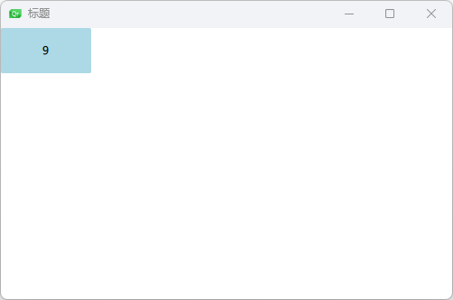
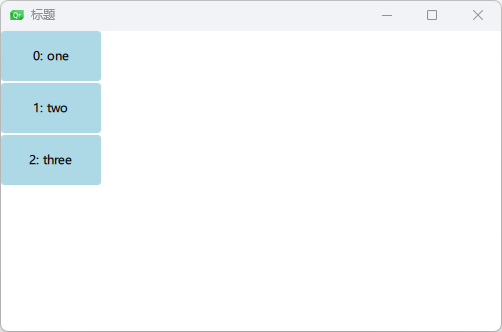
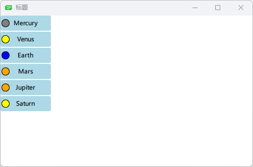
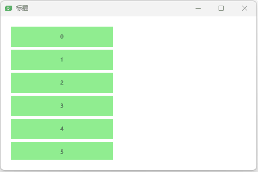
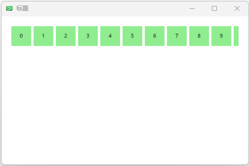
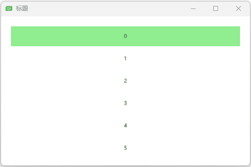
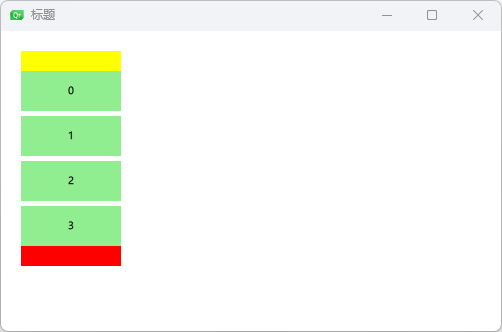
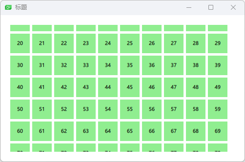
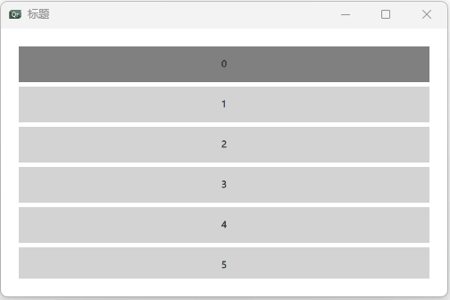
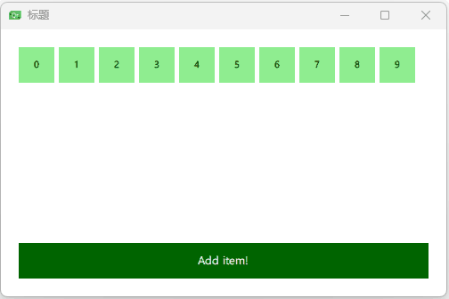

## 基础模型

最基本的实现举例，repeater元素⽤于实现⼦元素的标号。

```qml
import QtQuick 2.0
import QtMultimedia

Window {
    width: 500;
    height: 300;
    visible: true
    title: qsTr("标题");

    Repeater{
        model: 10;
        Rectangle{
            width: 100;
            height: 50;
            radius: 3;
            color: "lightBlue";
            Text {
                anchors.centerIn: parent;
                text: index;
            }
        }
    }
}
```



示例二

```qml
import QtQuick 2.0
import QtMultimedia

Window {
    width: 500;
    height: 300;
    visible: true
    title: qsTr("标题");

    Column{
        spacing: 2;
        Repeater{
            model: ["one","two","three"];
            Rectangle{
                width: 100;
                height: 50;
                radius: 3;
                color: "lightBlue";
                Text {
                    anchors.centerIn: parent;
                    text: index + ": " + modelData;
                }
            }
        }
    }
}
```



示例三

```qml
import QtQuick 2.0
import QtMultimedia

Window {
    width: 500;
    height: 300;
    visible: true
    title: qsTr("标题");

    Column{
        spacing: 2;
        Repeater{
            model: ListModel{
                ListElement { name: "Mercury"; surfaceColor: "gray" }
                ListElement { name: "Venus"; surfaceColor: "yellow" }
                ListElement { name: "Earth"; surfaceColor: "blue" }
                ListElement { name: "Mars"; surfaceColor: "orange" }
                ListElement { name: "Jupiter"; surfaceColor: "orange" }
                ListElement { name: "Saturn"; surfaceColor: "yellow" }
            }
            Rectangle{
                width: 100;
                height: 30;
                radius: 3;
                color: "lightBlue";
                Text {
                    anchors.centerIn: parent;
                    text: name;
                }
                Rectangle{
                    anchors.left: parent.left;
                    anchors.verticalCenter: parent.verticalCenter;
                    anchors.leftMargin: 2;
                    width: 16;
                    height: 16;
                    radius: 8;
                    border.color: "black";
                    border.width: 1;
                    color: surfaceColor
                }
            }
        }
    }
}
```



## 动态视图

### 示例一：基本滚动

```qml
import QtQuick 2.0
import QtMultimedia

Window {
    width: 500;
    height: 300;
    visible: true
    title: qsTr("标题");

    ListView {
        anchors.fill: parent;
        anchors.margins: 20;
        // 设置裁切
        clip: true;
        // 100个
        model: 100;
        delegate: numberDelegate;
        spacing: 5;
    }
    Component{
        id:numberDelegate;
        Rectangle{
            width: 200;
            height: 40;
            color: "lightGreen";
            Text {
                anchors.centerIn: parent;
                font.pixelSize: 10;
                text: index;
            }
        }
    }
}
```



### 示例二：设置水平方向

`orientation: ListView.Horizontal;`

```qml
import QtQuick 2.0
import QtMultimedia

Window {
    width: 500;
    height: 300;
    visible: true
    title: qsTr("标题");

    ListView {
        anchors.fill: parent;
        anchors.margins: 20;
        // 设置裁切
        clip: true;
        // 100个
        model: 100;
        // 设置水平方向
        orientation: ListView.Horizontal;
        delegate: numberDelegate;
        spacing: 5;
    }
    Component{
        id:numberDelegate;
        Rectangle{
            width: 40;
            height: 40;
            color: "lightGreen";
            Text {
                anchors.centerIn: parent;
                font.pixelSize: 10;
                text: index;
            }
        }
    }
}
```



### 示例三：键盘导航和⾼亮

```qml
import QtQuick 2.0
import QtMultimedia

Window {
    width: 500;
    height: 300;
    visible: true
    title: qsTr("标题");

    ListView {
        id: view
        anchors.fill: parent;
        anchors.margins: 20;
        // 设置裁切
        clip: true;
        // 100个
        model: 100;
        delegate: numberDelegate;
        spacing: 5;

        highlight: highlightComponent;
        focus: true;
    }

    Component{
        id: highlightComponent;
        Rectangle{
            width: ListView.view.width
            height: 40
            color: "lightGreen"
        }
    }

    Component{
        id:numberDelegate;
        Item{
            width: ListView.view.width
            height: 40
            // 去掉颜色
            // color: "lightGreen";
            Text {
                anchors.centerIn: parent;
                font.pixelSize: 10;
                text: index;
            }
        }

    }
}
```



### 示例四：页头和页脚

Header and Footer

```qml
import QtQuick 2.0
import QtMultimedia

Window {
    width: 500;
    height: 300;
    visible: true
    title: qsTr("标题");

    ListView {
        id: view
        anchors.fill: parent;
        anchors.margins: 20;
        // 设置裁切
        clip: true;
        model: 4;
        delegate: numberDelegate;
        spacing: 5;

        header: headerComponent;
        footer: footerComponent;
    }

    Component {
        id: headerComponent;
        Rectangle{
            width: 100;
            height: 20;
            color: "yellow";
        }
    }

    Component {
        id: footerComponent;
        Rectangle{
            width: 100;
            height: 20;
            color: "red";
        }
    }

    Component{
        id:numberDelegate;
        Rectangle{
            width: 100
            height: 40

            // 去掉颜色
            color: "lightGreen";
            Text {
                anchors.centerIn: parent;
                font.pixelSize: 10;
                text: index;
            }
        }

    }
}
```




### 示例五 网格视图

```qml
import QtQuick 2.0
import QtMultimedia

Window {
    width: 500;
    height: 300;
    visible: true
    title: qsTr("标题");

    GridView {
        id: view
        anchors.fill: parent;
        anchors.margins: 20;
        // 设置裁切
        clip: true;
        model: 100;
        cellWidth: 45;
        cellHeight: 45;
        delegate: numberDelegate;
    }

    Component{
        id:numberDelegate;
        Rectangle{
            width: 40
            height: 40

            color: "lightGreen";
            Text {
                anchors.centerIn: parent;
                font.pixelSize: 10;
                text: index;
            }
        }

    }
}
```




## 代理

当使⽤模型与视图来⾃定义⽤户界⾯时，代理在创建显⽰时扮演了⼤量的⾓⾊。在模型中的每个元素通过代理来实现可视化，⽤户真实可⻅的是这些代理元素。每个代理访问到索引号或者绑定的属性，⼀些是来⾃数据模型，⼀些来⾃视图。

来⾃**模型**的数据将会通过属性传递到代理。

来⾃**视图**的数据将会通过属性传递视图中与代理相关的**状态信息**。

视图状态信息`ListView.isCurrentItem`

视图模型数据`ListView.view.width`

```qml
import QtQuick 2.0
import QtMultimedia

Window {
    width: 500;
    height: 300;
    visible: true
    title: qsTr("标题");

    ListView {
        anchors.fill: parent;
        anchors.margins: 20;
        clip: true;
        model: 100;
        delegate:numberDelegate;
        spacing: 5;
        focus: true;
    }

    Component {
        id: numberDelegate;
        Rectangle {
            width: ListView.view.width;
            height: 40;
            color: ListView.isCurrentItem?"gray":"lightGray";
            Text {
                anchors.centerIn: parent;
                font.pixelSize: 10;
                text: index;
            }
        }
    }
}
```



### 动画添加与移除元素

QML视图为每个代理绑定了两个信号，`onAdd`和`onRemove`。使⽤动画连接它们，可以⽅便创建识别哪些内容被添加或删除的动画。

​		在屏幕下⽅，有⼀个添加新元素的按钮。当点击它时，会调⽤模型的append⽅法来添加⼀个新的元素。这个操作会触发视图创建⼀个新的代理，并发送`GridView.onAdd`信号。`SequentialAnimation`队列动画与这个信号连接绑定，使⽤代理的scale属性来放⼤视图元素。

​		当视图中的⼀个代理点击时，将会调⽤模型的remove⽅法将⼀个元素从模型中移除。这个操作将会导致`GridView.onRemove`信号的发送，触发另⼀个`SequentialAnimation`。这时，代理的销毁将会延迟直到动画完成。为了完成这个操作，`PropertyAction`元素需要在动画前设置`GridView.delayRemove`属性为true，并在动画后设置为false。这样确保了动画在代理项移除前完成。

```qml
import QtQuick 2.0
import QtMultimedia

Window {
    width: 500;
    height: 300;
    visible: true
    title: qsTr("标题");

    ListModel {
        id: theModel;
        ListElement { number: 0 }
        ListElement { number: 1 }
        ListElement { number: 2 }
        ListElement { number: 3 }
        ListElement { number: 4 }
        ListElement { number: 5 }
        ListElement { number: 6 }
        ListElement { number: 7 }
        ListElement { number: 8 }
        ListElement { number: 9 }
    }
    Rectangle {
        anchors.left: parent.left;
        anchors.right: parent.right;
        anchors.bottom: parent.bottom;
        anchors.margins: 20;
        height: 40;
        color: "darkGreen";
        Text {
            anchors.centerIn: parent;
            text: "Add item!";
            color: "white"
        }
        MouseArea {
            anchors.fill: parent;
            onClicked: {
                // 追加会触发onAdd
                theModel.append({"number":++parent.count})
            }
        }
        property int count: 9;
    }

    GridView{
        anchors.fill: parent;
        anchors.margins: 20;
        anchors.bottomMargin: 90;

        clip: true;
        model: theModel;
        cellWidth: 45;
        cellHeight: 45;
        delegate: numberDelegate;
    }

    Component {
        id:numberDelegate;
        Rectangle {
            id: wrapper;
            width: 40;
            height: 40;
            color: "lightGreen";
            Text {
                anchors.centerIn: parent;
                font.pixelSize: 10;
                text: number;
            }
            MouseArea {
                anchors.fill: parent;
                onClicked: {
                    // 判断是否被删除了
                    if(!wrapper.GridView.delayRemove){
                        // 删除会触发onRemove
                        theModel.remove(index)
                    }
                }
            }
            GridView.onRemove: SequentialAnimation{
                PropertyAction { target: wrapper; property: "GridView.delayRemove"; value: true }
                NumberAnimation { target: wrapper; property: "scale"; to: 0; duration: 250; easing.type: Easing.InOutQuad }
                PropertyAction { target: wrapper; property: "GridView.delayRemove"; value: false }
            }
            GridView.onAdd: SequentialAnimation {
                NumberAnimation { target: wrapper; property: "scale"; from: 0; to: 1; duration: 250; easing.type: Easing.InOutQuad }
            }
        }
    }

}
```




