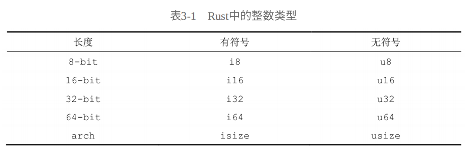
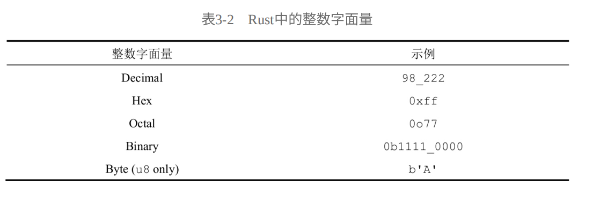

## 变量与可变性

Rust 中的变量默认是不可变的。 当⼀个变量是不可变的时，⼀旦它被绑定到某个值上⾯，这个值 就再也⽆法被改变。

错误示例：

下面的代码还⽆法通过编译，不能对不可变代码进行二次赋值

```rust {4}
fn main() {
    let x = 5;
    println!("这个变量的值是:{}", x);
    x = 6;
    println!("这个变量的值是:{}", x)
}
```

正确示例：

```rust {2,4}
fn main() {
    let mut x = 5;
    println!("这个变量的值是:{}", x);
    x = 6;
    println!("这个变量的值是:{}", x)
}
```

### 变量与常量之间的不同

1.  绑定到常量上的值⽆法被其他代码修改
2.  不能⽤ mut 关键字来修饰⼀个常量

```rust
const MAX_POINTS: u32 = 100_000;
```

### 隐藏

新声明的变量可以覆盖掉旧的同名变量。在 Rust 世界中，我们把这⼀现象描述为：第⼀个变量被第⼆个变量隐藏 （shadow）了。

```rust
fn main() {
    let x = 5;
    let x = x + 1;
    let x = x * 2;
    println!("这个变量的值是{}", x)
}
```

1. 隐藏机制不同于将⼀个变量声明为 mut，因为如果不是在使⽤ let 关键字的情况下重新为这个变量赋值，则会导致编译错误。
2. 隐藏机制允许我们复⽤ spaces 这个简单的名字，⽽不需要做出诸如 spaces_str 和 spaces_num 之类的区分。

## 数据类型

Rust 中的每⼀个值都有其特定的数据类型 ，Rust 会根据数据的类型来决定应该如何处理它们。我们会讨论两种不同的数据类型⼦集：标量类型 （scalar）和复合类型 （compound）。

Rust 是⼀门静态类型 语⾔，这意味着它在编译程序的过程中需要知道所有变量的具体类型。必须显式地添加⼀个类型标注。

错误示例

```rust
fn main() {
    let guess = "42".parse().expect("Not a number!");
}
```

正确示例

```rust
fn main() {
    let guess: u32 = "42".parse().expect("Not a number!");
}
```

### 标量类型

标量 类型是单个值类型的统称。Rust 中内建了 4 种基础的标量类型：整数、浮点数、布尔值及字符。

**整数类型**



Rust 对于整数字⾯量的默认推导类型`i32`通常就是⼀个很好的选择：它在⼤部分情形下都是运算速度最快的那⼀个，即便是在 64 位系统上也是如此。较为特殊的两个整数类型`usize`和`isize`则主要⽤作某些集合的索引。



**浮点数类型**

Rust 提供了两种基础的浮点数类型 ，浮点数也就是带⼩数的数字。这两种类型是 f32 和 f64，它们分别占⽤ 32 位和 64 位空间。由于在现代 CPU 中 f64 与 f32 的**运⾏效率相差⽆⼏**，却拥有更⾼的精度，所以在 Rust 中，默认会将浮点数字⾯量的类型推导为`f64`。

```rust
fn main() {
    let x = 2.0; // f64
    let y: f32 = 3.0; // f32
}
```

**数值运算**

Rust 都⽀持常⻅的数学运算：加法、减法、乘法、除法及取余。

```rust
fn main() {
    // 加法 i32
    let sum = 5 + 10;
    // 减法 f64
    let difference = 95.5 - 4.3;
    // 乘法 i32
    let product = 4 * 30;
    // 除法 f64
    let quotient = 56.7 / 32.2;
    // 取余 i32
    let remainder = 43 % 5;
}
```

**布尔类型**

Rust 的布尔类型只拥有两个可能的值：true 和 false，它会占据**单个字节**的空间⼤⼩。

```rust
fn main() {
    // bool
    let t = true;
    // 附带了显示类型标注的语句
    let f: bool = false;
}
```

**字符类型**

char 类型被⽤于描述语⾔中最基础的单个字符。char 类型使⽤**单引号**指定，⽽不同于字符串使⽤双引号指定。

```rust
fn main() {
    // char 类型
    let c = 'z';
}
```

### 复合类型

复合类型 （compound type）可以将多个不同类型的值组合为⼀个类型。Rust 提供了两种内置的基础复合类型：元组 （tuple）和数组（array）。

**元组类型**

元组是⼀种相当常⻅的复合类型，它可以将其他不同类型的多个值组合进⼀个复合类型中。元组还拥有⼀个固定的⻓度：你⽆法在声明结束后**增加或减少其中的元素数量**。

元组的访问可以通过两种方式**解构**和**点号**

```rust
fn main() {
    let tup: (i32, f64, u8) = (500, 6.4, 1);

    // 解构元组
    let (x, y, z) = tup;

    // 点号访问元组
    let five_hundred = tup.0;
    let six_point_four = tup.1;
    let one = tup.2;
}
```

**数组类型**

我们同样可以在数组 中存储多个值的集合。与元组不同，数组中的每⼀个元素都必须是**相同的类型**。Rust 中的数组拥有固定的⻓度，⼀旦声明就再也**不能随意更改⼤⼩**，这与其他某些语⾔有所不同。

```rust
fn main() {
    // 类型 [i32;5]
    let a = [1, 2, 3, 4, 5];
    // 类型 [&str;12]
    let months = [
        "January",
        "February",
        "March",
        "April",
        "May",
        "June",
        "July",
        "August",
        "September",
        "October",
        "November",
        "December",
    ];

    // 等价于let a = [3,3,3,3,3]
    let b = [3; 5];
}
```

`let a = [3; 5];` 等价于 `let a = [3, 3, 3, 3, 3];`

访问数组的元素

```rust
fn main() {
    let a = [1, 2, 3, 4, 5];
    let first = a[0];
    let second = a[1];
}
```

## 函数

`fn`关键来声明⼀个新的函数

```rust
fn main() {
    println!("Hello,world!");
    another_function();
}

fn another_function() {
    println!("Another function.")
}
```

### 函数参数

函数声明中定义参数 （parameter），它们是⼀种特殊的变量，并被视作函数签名的⼀部分。

```rust
fn main() {
    another_function(5, 6);
}

fn another_function(x: i32, y: i32) {
    println!("The value of x is {}", x);
    println!("The value of y is {}", y)
}
```

### 函数体中的语句和表达式

由于 Rust 是⼀门基于表达式的语⾔，所以它将**语句** （statement）与**表达式** （expression）区别为两个不同的概念，这与其他某些语⾔不同。

使⽤ let 关键字创建变量并绑定值时使⽤的指令是⼀条语句。

```rust
fn main() {
    // 语句
    let y = 6;
    // 错误的语句
    let z = y = 6;
}
```

你在 Rust 中编写的⼤部分代码都会是表达式。以简单的数学运算 5 + 6 为例，这就是⼀个表达式，并且会计算出值 11。

```rust
fn main() {
    let x = 5;
    let y = {
        let x = 3;
        x + 1
    };

    println!("The value of y is:{}", y); // 4
}
```

注意结尾处的表达式`x + 1`没有添加分号，假如我们在表达式的末尾加上了分号，这⼀段代码就变为了语句⽽不

会返回任何值。

**函数的返回值**

函数可以向调⽤它的代码返回值。虽然你不⽤为这个返回值命名，但需要在箭头符号`->`的后⾯声明它的类型。在 Rust 中，函数的返回值等同于函数体最后⼀个表达式的值。你可以使⽤`return`关键字并指定⼀个值来提前从函数中返回，但⼤多数函数都隐式地返回了最后的表达式。

```rust
fn main() {
    let x = plus_one(5);

    println!("The value of y is:{}", x);
}

fn plus_one(x: i32) -> i32 {
    x + 1
}
```

结尾处的 x + 1 加上分号，那么这个表达式就会变为语句并进⽽导致编译时错误。

```rust {8}
fn main() {
    let x = plus_one(5);

    println!("The value of y is:{}", x);
}

fn plus_one(x: i32) -> i32 {
    x + 1;
}
```

## 控制流

通过条件来执⾏或重复执⾏某些代码是⼤部分编程语⾔的基础组成部分。在 Rust 中⽤来控制程序执⾏流的结构主要就是**if 表达式**与**循环表达式**。

### if 表达式

假如这个条件满⾜，则运⾏这段代码。假如条件没有被满⾜，则跳过相应的代码。

```rust
fn main() {
    let number = 3;
    if number < 5 {
        println!("condition was true");
    } else {
        println!("condition was false")
    }
}
```

代码中的条件表达式必须产⽣⼀个bool类型的值，否则就会触发编译错误。

```rust {2}
fn main() {
    let number = 3;
    if number {
        println!("condition was true");
    } else {
        println!("condition was false")
    }
}
```

与Ruby或JavaScript等语⾔不同，Rust不会⾃动尝试将⾮布尔类型的值转换为布尔类型。你必须显式地在if表达式中提供⼀个布尔类型作为条件。

**多重条件判断**

```rust
fn main() {
    let number = 6;
    if number % 4 == 0 {
        println!("number is divisible by 4");
    } else if number % 3 == 0 {
        println!("number is divisible by 3");
    } else if number % 2 == 0 {
        println!("number is divisible by 2");
    } else {
        println!("number is not divisible by 4, 3, or 2");
    }
}
```

**在let语句中使⽤if**

```rust
fn main() {
    let condition = true;
    let number = if condition { 5 } else { 6 };
    println!("The value of number is {}", number); // The value of number is 5
}

```

所有if分⽀可能返回的值都必须是⼀种类型的；if分⽀与else分⽀的结果都是i32类型的整数。假如分⽀表达式产⽣的类型⽆法匹配，那么就会触发编译错误。

错误示例

```rust {3}
fn main() {
    let condition = true;
    let number = if condition { 5 } else { "six" };
    println!("The value of number is {}", number);
}
```

### 使⽤循环重复执⾏代码

Rust提供了3种循环：loop、while和for。

**使⽤loop重复执⾏代码**

使⽤loop关键字来指⽰Rust反复执⾏某⼀块代码，直到我们**显式地声明退出**为⽌。

```rust
fn main() {
    // 死循环代码
    loop {
        println!("again!");
    }
}
```

从loop循环中返回值

```rust
fn main() {
    let mut counter = 0;

    let result = loop {
        counter += 1;
        if counter == 10 {
            break counter * 2;
        }
    };

    println!("The result is {}", result) // 20
}
```

我们可以将需要返回的值添加到break表达式后⾯，也就是我们⽤来终⽌循环的表达式后⾯。接着，你就可以在代码中使⽤这个从循环中返回的值了

**while条件循环**

```rust
fn main() {
    let mut number = 3;

    while number != 0 {
        println!("{}!", number);
        number = number - 1;
    }
    println!("LIFTOFF!!!");
}
```

**使⽤for来循环遍历集合**

```rust
fn main() {
    let a = [10, 20, 30, 40, 50];

    for element in a.iter() {
        println!("the value is: {}", element);
    }
}
```

rev来翻转Range⽣成的序列

```rust
fn main() {
    for number in (1..4).rev() {
        println!("the value is: {}", number);
    }
}
```

