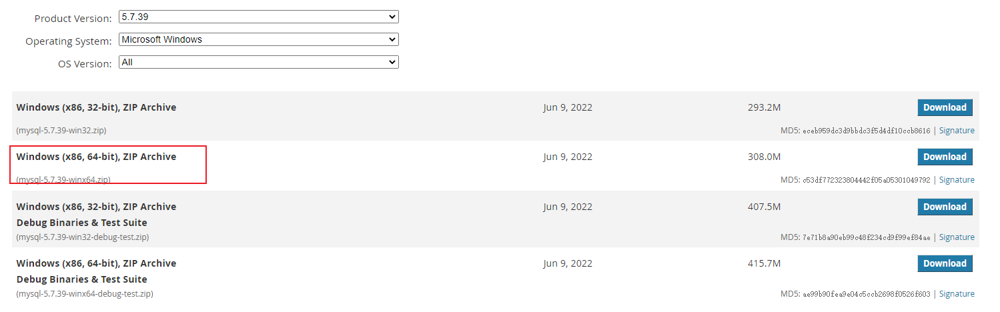
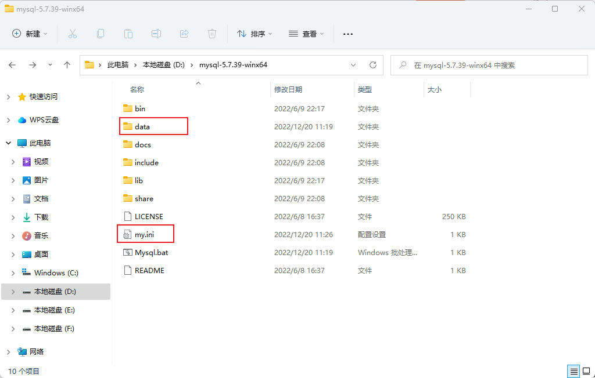

## 下载MySQL免安装

[下载链接](https://downloads.mysql.com/archives/community/)



## 创建配置文件



配置文件`my.ini`

```ini
[client]
# 设置端口
port=3306

[mysql]
# 设置mysql客户端默认字符集
default-character-set=utf8

[mysqld]
#跳过权限验证
skip-grant-tables

# 设置端口
port=3306

# 设置mysql的安装目录
basedir="D:/mysql-5.7.39-winx64/"

# 设置mysql数据库的数据的存放目录
datadir="D:/mysql-5.7.39-winx64/data/"

# 服务端使用的字符集默认为utf8
character-set-server=utf8

# 创建新表时将使用的默认存储引擎
default-storage-engine=INNODB

sql-mode="STRICT_TRANS_TABLES,NO_AUTO_CREATE_USER,NO_ENGINE_SUBSTITUTION"

# 允许最大连接数
max_connections=200
```

安装目录下执行

```
bin\mysqld --console --log_syslog=0 --initialize_insecure 
```

启动mysql的Windows批处理命令

```
# Mysql.bat
start bin\mysqld --console --log_syslog=0
```

修改mysql密码

```sql
alter user 'root'@'localhost' identified by '1234';
```

注释掉跳过验证

```
[mysqld]
#跳过权限验证
#skip-grant-tables
```

启动客户端

```
bin\mysql -uroot -p1234
```

