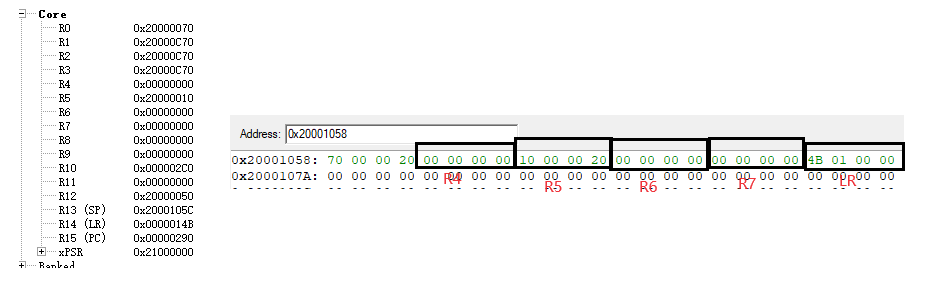
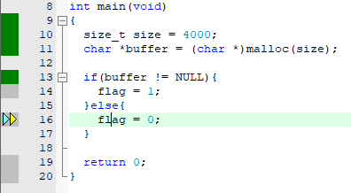

栈：用来分配内存函数调用中的变量存储

堆：用于通过malloc来分配内存

## stm32 栈

```c
Stack_Size      EQU     0x00000400

                AREA    STACK, NOINIT, READWRITE, ALIGN=3
Stack_Mem       SPACE   Stack_Size
__initial_sp
```

申请一个栈空间1024大小


在编译时会申请静态变量和全局变量的空间，其次是堆区，然后是栈区。


```c
#include "os.h"
#include "ARMCM3.h"

void func(void){
	int a = 1;
	int b = 2;
	int c = 3;
	int d = 4;
	int e = 5;
	
	e = a+b+c+d+e;
}

int main(void)
{	
	int f1 = 20;
	int f2 = 30;
	int f3 = 40;
	int f4 = 50;

	func();
	
	return 0;
}
```

先是main函数


`PUSH {r4-r7,lr}` 将1r，r7-r4寄存器的值压栈



```c
MOVS r4,#0x14  // 十进制20转为16进制为14
MOVS r5,#0x1E  // 十进制30转为16进制为1E
MOVS r6,#0x28  // 十进制40转为16进制为28
MOVS r7,#0x32  // 十进制50转为16进制为32   
```


```
BL.W func (0x00000278)
```

1. 将下一条指令的地址（返回地址）保存到链接寄存器 LR 中。
2. 跳转到 `func` 函数的地址开始执行。


这里LR的值并不是`0x0000029C`是因为最后一位用来表示这是**Thumb状态**


`PUSH {r4-r5,lr}`将寄存器的值压栈


```c
MOVS r4,#0x01    // int a = 1;
MOVS r0,#0x02    // int b = 2；
MOVS r1,#0x03    // int c = 3;
MOVS r2,#0x04    // int d = 4;
MOVS r3,#0x05    // int e = 5;
```


```c
// e = a+b+c+d+e;  1+2+3+4+5 = 15 等于16进制F
ADDS r5,r4,r0   // r5 = a+b;
ADD r5,r5,r1    // r5 = r5 + c
ADD r5,r5,r2    // r5 = r5 + d
ADD r3,r3,r5    // e = e + r5    
```


```c
POP {r4-r5,pc}
```

将栈中的值弹出给R4,R5,PC，跳回到main函数


PC = `0000029C` thum模式最后一位省略了

R5 = `0000001E`

R4 = `00000014`

```c
MOVS r0,#0x00  // return 0
```

如果申请的栈不够用，可能会覆盖前面的堆区，静态变量。


```c
#include "os.h"
#include "ARMCM3.h"
#include <stdlib.h>


int i = 0;
void func(void){
	int a = 1;
	int b = 2;
	int c = 3;
	int d = 4;
	int e = 5;
	
	e = a+b+c+d+e;
	
	if(i < 1000){
		++i;
		func();
	}
}

int main(void)
{	
	int f1 = 20;
	int f2 = 30;
	int f3 = 40;
	int f4 = 50;

	func();
	
	return 0;
}
```


SP堆指针的值覆盖到了Code代码所在的地址区域，导致了代码被覆盖。


## 堆

```c
Heap_Size       EQU     0x00000C00

                AREA    HEAP, NOINIT, READWRITE, ALIGN=3
__heap_base
Heap_Mem        SPACE   Heap_Size
__heap_limit
```

堆的空间大小为3072比特大小



当分配的空间大于堆空间大小时会分配失败；


当分配的空间小于堆空间大小时会分配成功。

