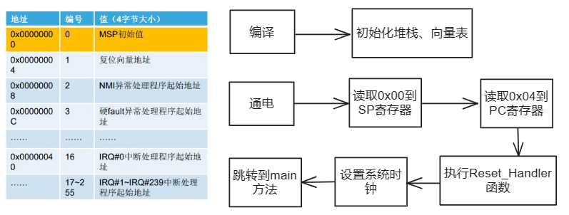
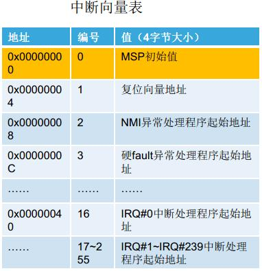
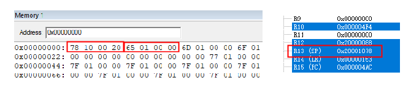
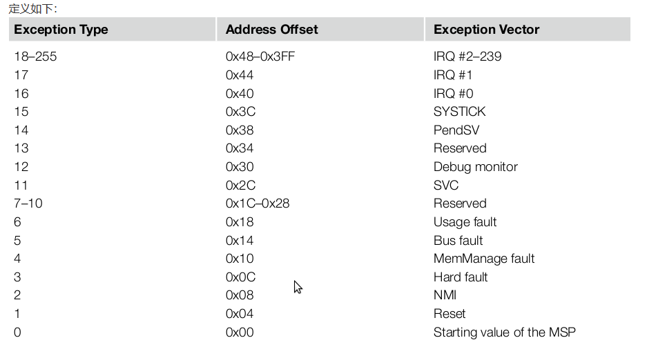
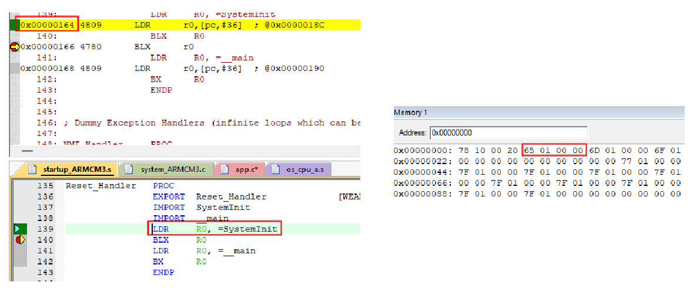
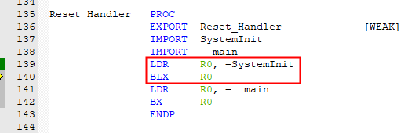
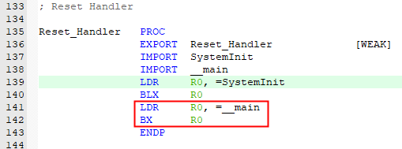

启动文件



## 中断向量表

1.芯片在上电的时候，在内部时序逻辑的控制下，将0x0000 0000地址的内容读取到**SP**；将0x0000 0004地址的内容读取到**PC**。此时SP中存放的是栈顶地址，PC中存放的是**Reset_Handler**复位处理函数地址。在链接阶段，链接器就决定了将程序中的各种数据类型和代码在FLASH中的存储地址。中断向量表存储在0x0000 0000空间上。

2.芯片执行Reset_Handler函数，进行时钟设置，最后跳入用户程序执行main函数。

```assembly
__Vectors       DCD     __initial_sp              ; Top of Stack
                DCD     Reset_Handler             ; Reset Handler
                DCD     NMI_Handler               ; NMI Handler
                DCD     HardFault_Handler         ; Hard Fault Handler
                DCD     MemManage_Handler         ; MPU Fault Handler
                DCD     BusFault_Handler          ; Bus Fault Handler
                DCD     UsageFault_Handler        ; Usage Fault Handler
                DCD     0                         ; Reserved
                DCD     0                         ; Reserved
                DCD     0                         ; Reserved
                DCD     0                         ; Reserved
                DCD     SVC_Handler               ; SVCall Handler
                DCD     DebugMon_Handler          ; Debug Monitor Handler
                DCD     0                         ; Reserved
                DCD     PendSV_Handler            ; PendSV Handler
                DCD     SysTick_Handler           ; SysTick Handler

                ; External Interrupts
                DCD     WDT_IRQHandler            ;  0:  Watchdog Timer
                DCD     RTC_IRQHandler            ;  1:  Real Time Clock
                DCD     TIM0_IRQHandler           ;  2:  Timer0 / Timer1
                DCD     TIM2_IRQHandler           ;  3:  Timer2 / Timer3
                DCD     MCIA_IRQHandler           ;  4:  MCIa
                DCD     MCIB_IRQHandler           ;  5:  MCIb
                DCD     UART0_IRQHandler          ;  6:  UART0 - DUT FPGA
                DCD     UART1_IRQHandler          ;  7:  UART1 - DUT FPGA
                DCD     UART2_IRQHandler          ;  8:  UART2 - DUT FPGA
                DCD     UART4_IRQHandler          ;  9:  UART4 - not connected
                DCD     AACI_IRQHandler           ; 10: AACI / AC97
                DCD     CLCD_IRQHandler           ; 11: CLCD Combined Interrupt
                DCD     ENET_IRQHandler           ; 12: Ethernet
                DCD     USBDC_IRQHandler          ; 13: USB Device
                DCD     USBHC_IRQHandler          ; 14: USB Host Controller
                DCD     CHLCD_IRQHandler          ; 15: Character LCD
                DCD     FLEXRAY_IRQHandler        ; 16: Flexray
                DCD     CAN_IRQHandler            ; 17: CAN
                DCD     LIN_IRQHandler            ; 18: LIN
                DCD     I2C_IRQHandler            ; 19: I2C ADC/DAC
                DCD     0                         ; 20: Reserved
                DCD     0                         ; 21: Reserved
                DCD     0                         ; 22: Reserved
                DCD     0                         ; 23: Reserved
                DCD     0                         ; 24: Reserved
                DCD     0                         ; 25: Reserved
                DCD     0                         ; 26: Reserved
                DCD     0                         ; 27: Reserved
                DCD     CPU_CLCD_IRQHandler       ; 28: Reserved - CPU FPGA CLCD
                DCD     0                         ; 29: Reserved - CPU FPGA
                DCD     UART3_IRQHandler          ; 30: UART3    - CPU FPGA
                DCD     SPI_IRQHandler            ; 31: SPI Touchscreen - CPU FPGA
__Vectors_End
```

**中断向量表**





在`0x00000000` 存放上电时会读取到MSP寄存器



`0x00000004` 存放复位地址上电时会读取到PC指针寄存器



`0x00000165` 中最后一位表示是thumb指令，所以PC指针对应的值为`0x00000164` 

## 设置系统时钟



```c
#include "ARMCM3.h"

/*----------------------------------------------------------------------------
  Define clocks
 *----------------------------------------------------------------------------*/
#define __HSI             ( 8000000UL)
#define __XTAL            ( 5000000UL)    /* Oscillator frequency             */

#define __SYSTEM_CLOCK    (5*__XTAL)


/*----------------------------------------------------------------------------
  System Core Clock Variable
 *----------------------------------------------------------------------------*/
uint32_t SystemCoreClock = __SYSTEM_CLOCK;/* System Core Clock Frequency      */


/**
 * Update SystemCoreClock variable
 *
 * @param  none
 * @return none
 *
 * @brief  Updates the SystemCoreClock with current core Clock
 *         retrieved from cpu registers.
 */
void SystemCoreClockUpdate (void)
{

  SystemCoreClock = __SYSTEM_CLOCK;

}

/**
 * Initialize the system
 *
 * @param  none
 * @return none
 *
 * @brief  Setup the microcontroller system.
 *         Initialize the System.
 */
void SystemInit (void)
{

#ifdef UNALIGNED_SUPPORT_DISABLE
  SCB->CCR |= SCB_CCR_UNALIGN_TRP_Msk;
#endif

  SystemCoreClock = __SYSTEM_CLOCK;

}
```

## 跳转到main函数



