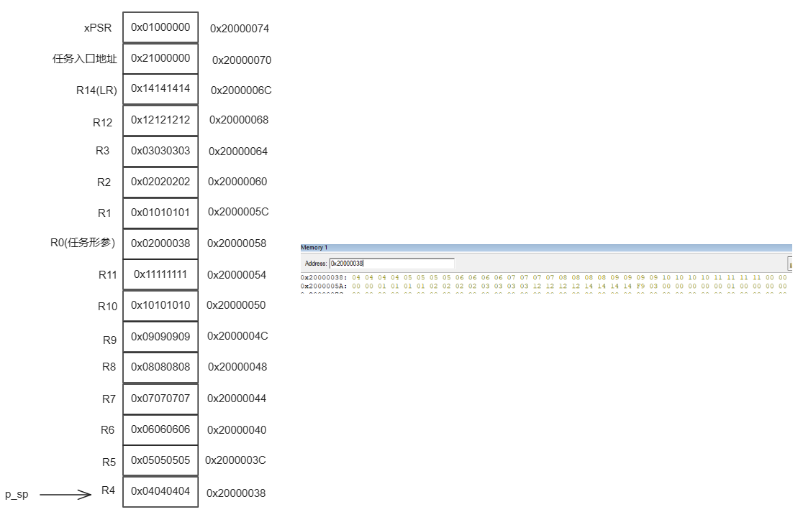
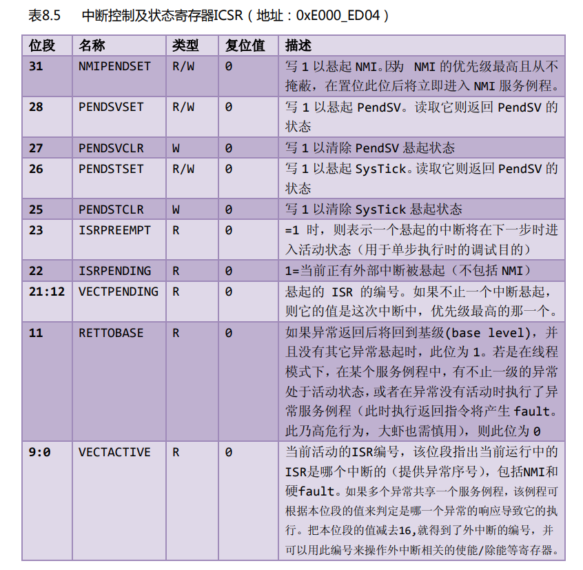

## 创建任务

### 1.定义任务栈

`cpu.h`中的数据定义

```c
#ifndef CPU_H
#define CPU_H

typedef  unsigned  short       CPU_INT16U;
typedef  unsigned  int         CPU_INT32U;
typedef  unsigned  char        CPU_INT08U;

typedef  CPU_INT32U  CPU_ADDR;

/* 堆栈数据类型重定义 */
typedef  CPU_INT32U             CPU_STK;
typedef  CPU_ADDR               CPU_STK_SIZE;

typedef  volatile  CPU_INT32U  CPU_REG32;

#endif /* CPU_H */
```

`app.c` 中定义任务栈

```c
// 设置任务栈大小为字节
#define  TASK1_STK_SIZE       128
#define  TASK2_STK_SIZE       128

// 定义任务栈
static   CPU_STK   Task1Stk[TASK1_STK_SIZE];
static   CPU_STK   Task2Stk[TASK2_STK_SIZE];
```

### 2.定义任务函数

`app.c`中定义任务函数,flag定义为了在逻辑分析仪中观察数据

```c
/* flag 必须定义成全局变量，才能添加到逻辑分析仪中观察波形
** 在逻辑分析仪中要设置为Bit模式才能看到波形，不能使用默认的模拟量
*/
uint32_t flag1;
uint32_t flag2;


/* 任务1 */
void Task1( void *p_arg )
{
     for ( ;; ) {
         flag1 = 1;
         delay( 100 );
         flag1 = 0;
         delay( 100 );
     }
}
 
 /* 任务2 */
void Task2( void *p_arg )
{
     for ( ;; ) {
         flag2 = 1;
         delay( 100 );
         flag2 = 0;
         delay( 100 );
     }
}
```

### 3.定义任务控制块

任务控制块就相当于任务的身份证，里面存有任务的所 有信息，比如任务的堆栈，任务名称，任务的形参等。有了这个任务控制块之后，以后系 统对任务的全部操作都可以通过这个 `TCB` 来实现。

`os.h` 中定义TCP结构

```c
// os.h
struct os_tcb
{
	CPU_STK         *StkPtr;
	CPU_STK_SIZE    StkSize;
};

typedef  struct  os_tcb  OS_TCB;
```

`app.c中`定义任务TCP

```c
static   OS_TCB    Task1TCB;
static   OS_TCB    Task2TCB;
```

### 4.实现任务创建函数

`os_task.c` 中定义任务创建函数

```c
#include "os.h"

void OSTaskCreate (OS_TCB        *p_tcb, 
                   OS_TASK_PTR   p_task, 
                   void          *p_arg,
                   CPU_STK       *p_stk_base,
                   CPU_STK_SIZE  stk_size,
                   OS_ERR        *p_err)
{
	CPU_STK       *p_sp;
	
    // 返回栈顶指针
	p_sp = OSTaskStkInit (p_task,p_arg,p_stk_base,stk_size);
    
	p_tcb->StkPtr = p_sp;
	p_tcb->StkSize = stk_size;

	*p_err = OS_ERR_NONE;
}
```

`p_tcb` 任务控制块

`p_task` 任务函数地址，要执行的函数`Task1`和`Task2`等

`p_arg` 任务形参

`p_stk_base` 任务栈起始位置,`Task1Stk[0]`所在地址

`p_stk_base` 任务栈大小

`os.cup_c.c` 任务初始化函数

```c
#include "os.h"

/* 任务堆栈初始化 */
CPU_STK *OSTaskStkInit (OS_TASK_PTR  p_task,
                        void         *p_arg,
                        CPU_STK      *p_stk_base,
                        CPU_STK_SIZE stk_size)
{
	CPU_STK  *p_stk;

	p_stk = &p_stk_base[stk_size];
															/* 异常发生时自动保存的寄存器                              */
	*--p_stk = (CPU_STK)0x01000000u;                        /* xPSR的bit24必须置1                                     */
	*--p_stk = (CPU_STK)p_task;                             /* 任务的入口地址                                         */
	*--p_stk = (CPU_STK)0x14141414u;                        /* R14 (LR)                                               */
	*--p_stk = (CPU_STK)0x12121212u;                        /* R12                                                    */
	*--p_stk = (CPU_STK)0x03030303u;                        /* R3                                                     */
	*--p_stk = (CPU_STK)0x02020202u;                        /* R2                                                     */
	*--p_stk = (CPU_STK)0x01010101u;                        /* R1                                                     */
	*--p_stk = (CPU_STK)p_arg;                              /* R0 : 任务形参                                          */
															/* 异常发生时需手动保存的寄存器                            */
	*--p_stk = (CPU_STK)0x11111111u;                        /* R11                                                    */
	*--p_stk = (CPU_STK)0x10101010u;                        /* R10                                                    */
	*--p_stk = (CPU_STK)0x09090909u;                        /* R9                                                     */
	*--p_stk = (CPU_STK)0x08080808u;                        /* R8                                                     */
	*--p_stk = (CPU_STK)0x07070707u;                        /* R7                                                     */
	*--p_stk = (CPU_STK)0x06060606u;                        /* R6                                                     */
	*--p_stk = (CPU_STK)0x05050505u;                        /* R5                                                     */
	*--p_stk = (CPU_STK)0x04040404u;                        /* R4                                                     */
	return (p_stk);
}
```

栈递减的生长方向。



全局变量 OSRDYList 定义

```c
// os_cfg.h
/* 支持最大的优先级 */
#define OS_CFG_PRIO_MAX                32u


// os.h
struct os_rdy_list
{
	OS_TCB        *HeadPtr;
	OS_TCB        *TailPtr;
};

typedef  struct  os_rdy_list         OS_RDY_LIST;

// 外部可访问变量extern
#define    OS_EXT  extern

OS_EXT    OS_RDY_LIST    OSRdyList[OS_CFG_PRIO_MAX];
```

添加就绪队列

```c
/* 将任务加入到就绪列表 */
OSRdyList[0].HeadPtr = &Task1TCB;
OSRdyList[1].HeadPtr = &Task2TCB;
```

## OS系统初始化

```c
// cpu.h
typedef  unsigned  char        CPU_INT08U;

// os_type.h
typedef   CPU_INT08U      OS_STATE;

// os.h
OS_EXT    OS_TCB         *OSTCBCurPtr;
OS_EXT    OS_TCB         *OSTCBHighRdyPtr;
OS_EXT    OS_STATE       OSRunning;

#define  OS_STATE_OS_STOPPED    (OS_STATE)(0u)

struct os_rdy_list
{
	OS_TCB        *HeadPtr;
	OS_TCB        *TailPtr;
};

typedef  struct  os_rdy_list         OS_RDY_LIST;
```

`os_core.c` os系统初始化

```c
#include "os.h"

/* RTOS初始化
** 初始化全局变量
*/
void OSInit (OS_ERR *p_err)
{
	OSRunning =  OS_STATE_OS_STOPPED;
	
	OSTCBCurPtr = (OS_TCB *)0;
	OSTCBHighRdyPtr = (OS_TCB *)0;
	
    // 就绪队列初始化
	OS_RdyListInit();
	
	*p_err = OS_ERR_NONE;
}


/* 就绪列表初始化 */
void OS_RdyListInit(void)
{
	OS_PRIO i;
	OS_RDY_LIST *p_rdy_list;
	
	for( i=0u; i<OS_CFG_PRIO_MAX; i++ )
	{
		p_rdy_list = &OSRdyList[i];
		p_rdy_list->HeadPtr = (OS_TCB *)0;
		p_rdy_list->TailPtr = (OS_TCB *)0;
	}
}


```


## 启动系统

`os_core.c` 启动系统

```c
/* 启动RTOS，将不再返回 */
void OSStart (OS_ERR *p_err)
{	
	if( OSRunning == OS_STATE_OS_STOPPED )
	{
		/* 手动配置任务1先运行 */
		OSTCBHighRdyPtr = OSRdyList[0].HeadPtr;
		
		/* 启动任务切换，不会返回 */
		OSStartHighRdy();
		
		/* 不会运行到这里，运行到这里表示发生了致命的错误 */
		*p_err = OS_ERR_FATAL_RETURN;
	}
	else
	{
		*p_err = OS_STATE_OS_RUNNING;
	}
}
```

OSStartHighRdy() 函数

```assembly
;********************************************************************************************************
;                                               常量
;********************************************************************************************************
;--------------------------------------------------------------------------------------------------------
;有关内核外设寄存器定义可参考官方文档：STM32F10xxx Cortex-M3 programming manual
;系统控制块外设SCB地址范围：0xE000ED00-0xE000ED3F
;--------------------------------------------------------------------------------------------------------
NVIC_INT_CTRL   EQU     0xE000ED04                              ; 中断控制及状态寄存器 SCB_ICSR。
NVIC_SYSPRI14   EQU     0xE000ED22                              ; 系统优先级寄存器 SCB_SHPR3：bit16~23
NVIC_PENDSV_PRI EQU           0xFF                              ; PendSV 优先级的值(最低)。
NVIC_PENDSVSET  EQU     0x10000000                              ; 触发PendSV异常的值 Bit28：PENDSVSET。

;********************************************************************************************************
;                                          开始第一次上下文切换
; 1、配置PendSV异常的优先级为最低
; 2、在开始第一次上下文切换之前，设置psp=0
; 3、触发PendSV异常，开始上下文切换
;********************************************************************************************************
OSStartHighRdy
	LDR		R0, = NVIC_SYSPRI14              ; 设置  PendSV 异常优先级为最低
	LDR     R1, = NVIC_PENDSV_PRI
	STRB    R1, [R0]
	
	MOVS    R0, #0                           ; 设置psp的值为0，开始第一次上下文切换
	MSR     PSP, R0
	
	LDR     R0, =NVIC_INT_CTRL               ; 触发PendSV异常
	LDR     R1, =NVIC_PENDSVSET
	STR     R1, [R0]
	
	CPSIE   I                                 ; 开中断
	
OSStartHang
	B       OSStartHang                       ; 程序应永远不会运行到这里	
```

## 任务切换

`app.c`任务切换`OSSched()`

```c
/* 任务1 */
void Task1( void *p_arg )
{
	for( ;; )
	{
		flag1 = 1;
		delay( 100 );		
		flag1 = 0;
		delay( 100 );
		
		/* 任务切换，这里是手动切换 */		
		OSSched();
	}
}
```

`OSSched()` 任务切换

```c
/* 任务切换，实际就是触发PendSV异常，然后在PendSV异常中进行上下文切换 */
void OSSched (void)
{
	if( OSTCBCurPtr == OSRdyList[0].HeadPtr )
	{
		OSTCBHighRdyPtr = OSRdyList[1].HeadPtr;
	}
	else
	{
		OSTCBHighRdyPtr = OSRdyList[0].HeadPtr;
	}
	
	OS_TASK_SW();
}
```

`OS_TASK_SW()` 触发中断

```c
#ifndef  NVIC_INT_CTRL
#define  NVIC_INT_CTRL                      *((CPU_REG32 *)0xE000ED04)   /* 中断控制及状态寄存器 SCB_ICSR */
#endif

#ifndef  NVIC_PENDSVSET
#define  NVIC_PENDSVSET                                    0x10000000    /* 触发PendSV异常的值 Bit28：PENDSVSET */
#endif

#define  OS_TASK_SW()               NVIC_INT_CTRL = NVIC_PENDSVSET
#define  OSIntCtxSw()               NVIC_INT_CTRL = NVIC_PENDSVSET
```



在第28为设置为1悬起PendSV中断

**PendSV中断处理函数**

```assembly
;********************************************************************************************************
;                                          PendSVHandler异常
;********************************************************************************************************
PendSV_Handler
; 任务的保存，即把CPU寄存器的值存储到任务的堆栈中	
	CPSID   I                                 ; 关中断，NMI和HardFault除外，防止上下文切换被中断	
	MRS     R0, PSP                           ; 将psp的值加载到R0
	CBZ     R0, OS_CPU_PendSVHandler_nosave   ; 判断R0，如果值为0则跳转到OS_CPU_PendSVHandler_nosave
	                                          ; 进行第一次任务切换的时候，R0肯定为0
	
	; 在进入PendSV异常的时候，当前CPU的xPSR，PC（任务入口地址），R14，R12，R3，R2，R1，R0会自动存储到当前任务堆栈，同时递减PSP的值
	STMDB   R0!, {R4-R11}                     ; 手动存储CPU寄存器R4-R11的值到当前任务的堆栈
	
	LDR     R1, = OSTCBCurPtr                 ; 加载 OSTCBCurPtr 指针的地址到R1，这里LDR属于伪指令
	LDR     R1, [R1]                          ; 加载 OSTCBCurPtr 指针到R1，这里LDR属于ARM指令
	STR     R0, [R1]                          ; 存储R0的值到	OSTCBCurPtr->OSTCBStkPtr，这个时候R0存的是任务空闲栈的栈顶

; 任务的切换，即把下一个要运行的任务的堆栈内容加载到CPU寄存器中
OS_CPU_PendSVHandler_nosave  
	; OSTCBCurPtr = OSTCBHighRdyPtr;
	LDR     R0, = OSTCBCurPtr                 ; 加载 OSTCBCurPtr 指针的地址到R0，这里LDR属于伪指令
	LDR     R1, = OSTCBHighRdyPtr             ; 加载 OSTCBHighRdyPtr 指针的地址到R1，这里LDR属于伪指令
	LDR     R2, [R1]                          ; 加载 OSTCBHighRdyPtr 指针到R2，这里LDR属于ARM指令
	STR     R2, [R0]                          ; 存储 OSTCBHighRdyPtr 到 OSTCBCurPtr
	
	LDR     R0, [R2]                          ; 加载 OSTCBHighRdyPtr 到 R0
	LDMIA   R0!, {R4-R11}                     ; 加载需要手动保存的信息到CPU寄存器R4-R11
	
	MSR     PSP, R0                           ; 更新PSP的值，这个时候PSP指向下一个要执行的任务的堆栈的栈底（这个栈底已经加上刚刚手动加载到CPU寄存器R4-R11的偏移）
	ORR     LR, LR, #0x04                     ; 确保异常返回使用的堆栈指针是PSP，即LR寄存器的位2要为1
	CPSIE   I                                 ; 开中断
	BX      LR                                ; 异常返回，这个时候任务堆栈中的剩下内容将会自动加载到xPSR，PC（任务入口地址），R14，R12，R3，R2，R1，R0（任务的形参）
	                                          ; 同时PSP的值也将更新，即指向任务堆栈的栈顶。在STM32中，堆栈是由高地址向低地址生长的。
	
	NOP                                       ; 为了汇编指令对齐，不然会有警告
	
	
	END                                       ; 汇编文件结束
```

## main函数

```c
#include "os.h"
#include "ARMCM3.h"

uint32_t flag1;
uint32_t flag2;

// TCB & STACK & 任务声明
#define  TASK1_STK_SIZE       20
#define  TASK2_STK_SIZE       20

static   CPU_STK   Task1Stk[TASK1_STK_SIZE];
static   CPU_STK   Task2Stk[TASK2_STK_SIZE];

static   OS_TCB    Task1TCB;
static   OS_TCB    Task2TCB;

void     Task1( void *p_arg );
void     Task2( void *p_arg );

// 函数声明
void delay(uint32_t count);

/*
************************************************************************************************************************
*                                                    main函数
************************************************************************************************************************
*/
/*
* 注意事项：1、该工程使用软件仿真，debug需选择 Ude Simulator
*           2、在Target选项卡里面把晶振Xtal(Mhz)的值改为25，默认是12，
*              改成25是为了跟system_ARMCM3.c中定义的__SYSTEM_CLOCK相同，确保仿真的时候时钟一致
*/
int main(void)
{	
	OS_ERR err;
	
	
	
	/* 初始化相关的全局变量 */
	OSInit(&err);
	
	/* 创建任务 */
	OSTaskCreate ((OS_TCB*)      &Task1TCB, 
	              (OS_TASK_PTR ) Task1, 
	              (void *)       0,
	              (CPU_STK*)     &Task1Stk[0],
	              (CPU_STK_SIZE) TASK1_STK_SIZE,
	              (OS_ERR *)     &err);

	OSTaskCreate ((OS_TCB*)      &Task2TCB, 
	              (OS_TASK_PTR ) Task2, 
	              (void *)       0,
	              (CPU_STK*)     &Task2Stk[0],
	              (CPU_STK_SIZE) TASK2_STK_SIZE,
	              (OS_ERR *)     &err);
				  
	/* 将任务加入到就绪列表 */
	OSRdyList[0].HeadPtr = &Task1TCB;
	OSRdyList[1].HeadPtr = &Task2TCB;
	
	/* 启动OS，将不再返回 */				
	OSStart(&err);
}

/*
************************************************************************************************************************
*                                                    函数实现
************************************************************************************************************************
*/
/* 软件延时 */
void delay (uint32_t count)
{
	for(; count!=0; count--);
}


/* 任务1 */
void Task1( void *p_arg )
{
	for( ;; )
	{
		flag1 = 1;
		delay( 100 );		
		flag1 = 0;
		delay( 100 );
		
		/* 任务切换，这里是手动切换 */		
		OSSched();
	}
}

/* 任务2 */
void Task2( void *p_arg )
{
	for( ;; )
	{
		flag2 = 1;
		delay( 100 );		
		flag2 = 0;
		delay( 100 );
		
		/* 任务切换，这里是手动切换 */
		OSSched();
	}
}
```

