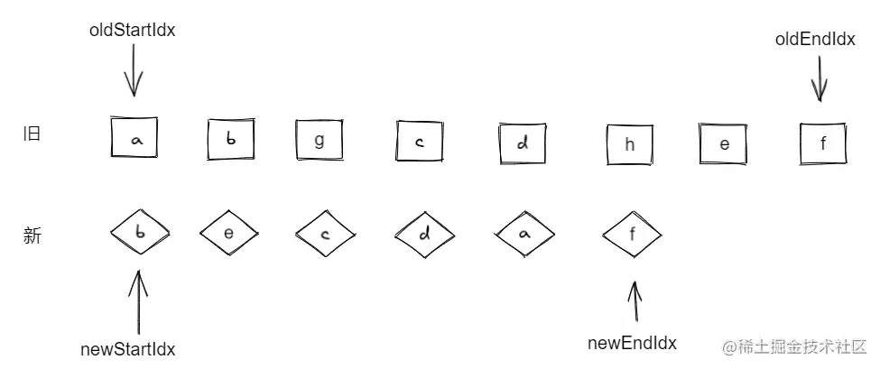

## 双端 diff 原理



1.如果 oldStartVNode 和 newStartVNode 的 key 相同，则同时向后移

2.如果 oldEndVNode 和 newEndVNode 的 key 相同，则同时向前移

3.如果 oldStartVNode 和 newEndVNode 相同，则 oldStartIdx 向后移，newEndId 向前移

4.如果 oldEndVNode 和 newStartVNode 相同，则 newStartIdx 向后移,oldEndIdx 向前移

```js
function patchKeyedChildren(n1, n2, container) {
  const oldChildren = n1.children;
  const newChildren = n2.children;
  // 四个索引值
  let oldStartIdx = 0;
  let oldEndIdx = oldChildren.length - 1;
  let newStartIdx = 0;
  let newEndIdx = newChildren.length - 1;
  // 四个索引值指向vnode节点
  let oldStartVNode = oldChildren[oldStartIdx];
  let oldEndVNode = oldChildren[oldEndIdx];
  let newStartVNode = newChildren[newStartIdx];
  let newEndVNode = newChildren[newEndIdx];

  while (oldStartIdx <= oldEndIdx && newStartIdx <= newEndIdx) {
    if (oldStartVNode.key === newStartVNode.key) {
      // 第一步：oldStartVNode 和 newStartVNode 比较
      patch(oldStartVNode, newStartVNode, container);
      oldStartVNode = oldChildren[++oldStartIdx];
      newStartVNode = newChildren[++newStartIdx];
    } else if (oldEndVNode.key === newEndVNode.key) {
      // 第二步：oldEndVNode 和 newEndVNode比较
      patch(oldEndVNode, newEndVNode, container);
      oldEndVNode = oldChildren[--oldEndIdx];
      newEndVNode = newChildren[--newEndIdx];
    } else if (oldStartVNode.key === newEndVNode.key) {
      // 第三步: oldStartVNode 和 newEndVNode 比较
      patch(oldStartVNode, newEndVNode, container);
      insert(oldStartVNode.el, container, newEndVNode.el.nextSibling);

      oldStartVNode = oldChildren[++oldStartIdx];
      newEndVNode = newChildren[--newEndIdx];
    } else if (oldEndVNode.key === newStartVNode.key) {
      // 第四步：oldEndVNode 和 newStartVNode 比较
      // 仍然需要调用patch函数进行打补丁
      patch(oldEndVNode, newStartVNode, container);
      // 移动DOM操作
      // oldEndVNode.el 移动到 oldStartVNode.el前面
      insert(oldEndVNode.el, container, oldStartVNode.el);

      oldEndVNode = oldChildren[--oldEndIdx];
      newStartVNode = newChildren[++newStartIdx];
    }
  }
}
```

## 非理想状况的处理方式

非理想状态: 四次都没找到相同的节点

1.在旧的列表中找到 newStartVNode 相同 key 的 index

2.通过 index 从旧列表中获取当前节点，然后给当前旧节点打上补丁

3.在 oldStartVNode 之前插入这个节点

4.清空 index 所在旧节点的值

5.newStartIdx 到下一位置

增加两个判断分支，如果头尾部节点为 undefined，则说明该节点已经被处理过了，直接跳到下一个位置

```js
function patchKeyedChildren(n1, n2, container) {
  const oldChildren = n1.children;
  const newChildren = n2.children;
  // 四个索引值
  let oldStartIdx = 0;
  let oldEndIdx = oldChildren.length - 1;
  let newStartIdx = 0;
  let newEndIdx = newChildren.length - 1;
  // 四个索引值指向vnode节点
  let oldStartVNode = oldChildren[oldStartIdx];
  let oldEndVNode = oldChildren[oldEndIdx];
  let newStartVNode = newChildren[newStartIdx];
  let newEndVNode = newChildren[newEndIdx];

  while (oldStartIdx <= oldEndIdx && newStartIdx <= newEndIdx) {
    // 增加两个判断分支，如果头尾部节点为 undefined，则说明该节点已经被处理过了，直接跳到下一个位置
    if (!oldStartVNode) {
      oldStartVNode = oldChildren[++oldStartIdx];
    } else if (!oldEndVNode) {
      oldEndVNode = oldChildren[--oldEndIdx];
    } else if (oldStartVNode.key === newStartVNode.key) {
      // 省略...
    } else if (oldEndVNode.key === newEndVNode.key) {
      // 省略...
    } else if (oldStartVNode.key === newEndVNode.key) {
      // 省略...
    } else if (oldEndVNode.key === newStartVNode.key) {
      // 省略...
    } else {
      // 遍历旧 children，视图寻找与 newStartVNode 拥有相同 key 值的元素
      // idxInOld 就是新的一组子节点的头部节点在旧的一组子节点中的索引
      const idxInOld = oldChildren.findIndex(
        (node) => node.key === newStartVNode.key
      );
      // idxInOld 大于 0，说明找到了可复用的节点，并且需要将其对应的真实DOM移动到头部
      if (idxInOld > 0) {
        // idxInOld 位置对应的 vnode 就是需要移动的节点
        const vnodeToMove = oldChildren[idxInOld];
        // 不要忘记除移动操作外还应该打补丁
        patch(vnodeToMove, newStartVNode, container);
        // 将 vnodeToMove.el 移动到头部节点 oldStartVNode.el 之前，因此使用后者作为锚点
        insert(vnodeToMove.el, container, oldStartVNode.el);
        // 由于位置 idxInOld 处的节点所对应的真实DOM已经移动到了别处，因此将其设置为undefined
        oldChildren[idxInOld] = undefined;
        // 最后更新 newStartIdx 到下一位置
        newStartVNode = newChildren[++newStartIdx];
      }
    }
  }
}
```

## 添加新元素

如果找不到新元素在旧列表中的对应位置则添加元素 oldStartIdx 所在位置

```js {47}
function patchKeyedChildren(n1, n2, container) {
  const oldChildren = n1.children;
  const newChildren = n2.children;
  // 四个索引值
  let oldStartIdx = 0;
  let oldEndIdx = oldChildren.length - 1;
  let newStartIdx = 0;
  let newEndIdx = newChildren.length - 1;
  // 四个索引值指向vnode节点
  let oldStartVNode = oldChildren[oldStartIdx];
  let oldEndVNode = oldChildren[oldEndIdx];
  let newStartVNode = newChildren[newStartIdx];
  let newEndVNode = newChildren[newEndIdx];

  while (oldStartIdx <= oldEndIdx && newStartIdx <= newEndIdx) {
    // 增加两个判断分支，如果头尾部节点为 undefined，则说明该节点已经被处理过了，直接跳到下一个位置
    if (!oldStartVNode) {
      oldStartVNode = oldChildren[++oldStartIdx];
    } else if (!oldEndVNode) {
      oldEndVNode = oldChildren[--oldEndIdx];
    } else if (oldStartVNode.key === newStartVNode.key) {
      // 省略...
    } else if (oldEndVNode.key === newEndVNode.key) {
      // 省略...
    } else if (oldStartVNode.key === newEndVNode.key) {
      // 省略...
    } else if (oldEndVNode.key === newStartVNode.key) {
      // 省略...
    } else {
      // 遍历旧 children，视图寻找与 newStartVNode 拥有相同 key 值的元素
      // idxInOld 就是新的一组子节点的头部节点在旧的一组子节点中的索引
      const idxInOld = oldChildren.findIndex(
        (node) => node.key === newStartVNode.key
      );
      // idxInOld 大于 0，说明找到了可复用的节点，并且需要将其对应的真实DOM移动到头部
      if (idxInOld > 0) {
        // idxInOld 位置对应的 vnode 就是需要移动的节点
        const vnodeToMove = oldChildren[idxInOld];
        // 不要忘记除移动操作外还应该打补丁
        patch(vnodeToMove, newStartVNode, container);
        // 将 vnodeToMove.el 移动到头部节点 oldStartVNode.el 之前，因此使用后者作为锚点
        insert(vnodeToMove.el, container, oldStartVNode.el);
        // 由于位置 idxInOld 处的节点所对应的真实DOM已经移动到了别处，因此将其设置为undefined
        oldChildren[idxInOld] = undefined;
      } else {
        // 将 newStartVNode 作为新节点挂载到头部，使用当前头部节点oldStartVNode.el 作为锚点
        patch(null, newStartVNode, container, oldStartVNode.el);
      }
      // 最后更新 newStartIdx 到下一位置
      newStartVNode = newChildren[++newStartIdx];
    }
  }
}
```

## 移除不存在的元素

```js {34-45}
function patchKeyedChildren(n1, n2, container) {
  const oldChildren = n1.children;
  const newChildren = n2.children;
  // 四个索引值
  let oldStartIdx = 0;
  let oldEndIdx = oldChildren.length - 1;
  let newStartIdx = 0;
  let newEndIdx = newChildren.length - 1;
  // 四个索引值指向vnode节点
  let oldStartVNode = oldChildren[oldStartIdx];
  let oldEndVNode = oldChildren[oldEndIdx];
  let newStartVNode = newChildren[newStartIdx];
  let newEndVNode = newChildren[newEndIdx];

  while (oldStartIdx <= oldEndIdx && newStartIdx <= newEndIdx) {
    // 增加两个判断分支，如果头尾部节点为 undefined，则说明该节点已经被处理过了，直接跳到下一个位置
    if (!oldStartVNode) {
      // 省略...
    } else if (!oldEndVNode) {
      // 省略...
    } else if (oldStartVNode.key === newStartVNode.key) {
      // 省略...
    } else if (oldEndVNode.key === newEndVNode.key) {
      // 省略...
    } else if (oldStartVNode.key === newEndVNode.key) {
      // 省略...
    } else if (oldEndVNode.key === newStartVNode.key) {
      // 省略...
    } else {
      // 省略...
    }
  }

  // 循环结束后检查索引值的情况，
  if (oldEndIdx < oldStartIdx && newStartIdx <= newEndIdx) {
    // 如果满足条件，则说明有新的节点遗留，需要挂载它们
    for (let i = newStartIdx; i <= newEndIdx; i++) {
      patch(null, newChildren[i], container, oldStartVNode.el);
    }
  } else if (newEndIdx < newStartIdx && oldStartIdx <= oldEndIdx) {
    // 移除操作
    for (let i = oldStartIdx; i <= oldEndIdx; i++) {
      unmount(oldChildren[i]);
    }
  }
}
```
